# Adaptive_Multimode_Process_Monitoring_CN

# 基于模式匹配与相似性保持字典学习的 自适应多模态过程监控

黄珂珂  陶醉  刘逸孙  孙蓓  杨春华  桂卫华  胡石岩 摘自 IEEE Transactions on Cybernetics, VOL. 53, NO. 6, JUNE 2023 摘要：

在实际工业过程中，制造策略和生产技术的变化等因素导致多模态工业过程的产生和新模态的不断涌现。尽管工业SCADA系统积累了大 量历史数据，可在一定程度上用于多模态过程的建模和监控，但用历史数据学习的模型难以适应新兴模态，导致模型失配。另一方面， 用新模态数据更新模型可使模型不断匹配新模态，但可能导致模型丧失对历史模态的表征能力，即所谓的灾难性遗忘。为解决这些问题 ，本文提出了一种联合模式匹配与相似性保持字典学习(JMSDL)方法，通过学习新模态数据来更新模型，使模型能够自适应匹配新出现 的模态。同时，提出了相似性度量以保证所提方法对历史数据的表征能力。数值仿真实验、CSTH过程实验和工业焙烧过程实验表明，所 提JMSDL方法能够匹配新模态，同时准确保持其在历史模态上的性能。此外，所提方法在故障检测率和误报率方面显著优于现有方法。

关键词：自适应模型更新、字典学习、模型失配、多模态过程建模、过程监控

## I. 引言

如今，工业过程日益复杂，随着计算机和传感器技术的发展，大量过程数据被采集，为数据驱动的过程监控方法提供了充足的信息。然 而，在实际工业过程中，制造策略和生产技术的变化等因素往往导致多模态工业过程的产生和新模态的不断涌现。多模态数据难以建模 和监控，因为不同模态具有不同的分布特征。目前有三类方法来解决这一问题，包括多模型方法、全局建模方法和在线模型更新方法。

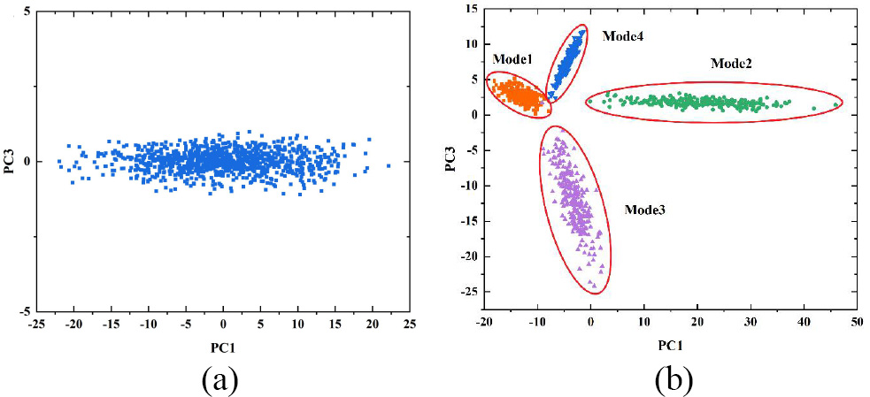

图 1. 单模态和多模态数据可视化。(a) 单模态数据的主成分。(b) 多模态数据的主成分。对于多模态数据，不同模态呈现不同分布。

多模型方法的思路直观，使用多个模型分别匹配各模态，因其思路简单、性能良好而被广泛使用。然而，多模型方法也有明显缺点。如 果新模态不断出现，需要不断建立新模型，这是一个非常繁琐且耗时的过程。此外，多模型方法还面临统计平均问题。全局建模方法致 力于建立一个能够表征所有模态数据的单一模型。但在处理多模态数据时，全局建模方法也面临统计平均问题，可能导致某些模态的表 征效果不佳。

字典学习是一种强大的机器学习方法，其目标是训练一个具有数据表征能力的字典。字典矩阵的每一列称为一个原子，使用少量原子对 数据进行线性表示。字典学习在过程监控领域有着广泛的应用。在流程工业中，模态被定义为某一操作条件下的过程。实际工业过程的 模态会因市场需求、产品规格、原材料、制造策略和外部环境波动等因素而发生变化，导致新模态不断产生。

以中国湖南省某锌冶炼厂的焙烧过程为例，由于不同时间段的过程指标和制造策略不同，焙烧过程可分为高效条件和健康条件。如果按 照化学反应对焙烧过程条件进行分类，可分为过分解条件、欠氧化条件和床层沉积条件。因此，焙烧过程数据具有复杂的模态特征。

- 1 -

<!-- Page 2 -->

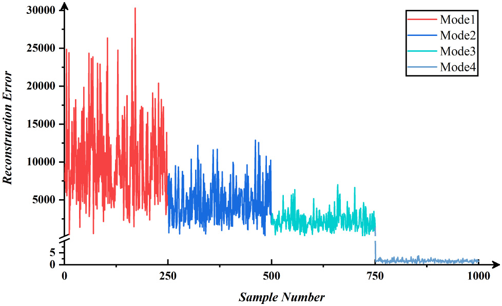

图 2. ODL方法的灾难性遗忘现象。随着新模态数据的不断学习，模型遗忘如何表征先前数据，导致较高的重构误差。

为解决持续增加模态的多模态过程监控问题并同时消除灾难性遗忘的负面影响，本文提出了一种联合模式匹配与相似性保持字典学习(J MSDL)方法。过完备字典在字典学习中被广泛使用，这使得字典中有足够的冗余空间来存储多个模态的特征。因此，字典学习在处理多 模态数据方面具有明显优势，仅使用一个字典即可表征多个模态的数据。

我们的方法首先使用K-SVD方法在第一个模态的数据上训练初始字典。当新模态出现时，仅使用新模态的数据通过JMSDL方法更新字典， 使字典能够表征新模态的数据而不丧失对历史模态数据的表征能力。通过依次使用所有模态的数据更新字典，我们最终获得一个能够表 征所有模态的字典，并用其监控多模态过程。

本文的主要贡献如下：

1. 提出了JMSDL方法，通过最小化新模态数据的重构误差来自适应更新过程监控模型，以确保模型匹配。
2. 所提JMSDL方法通过在优化函数中提出保持项来克服灾难性遗忘，确保模型更新前后的相似性。
3. 所提JMSDL方法为多模态过程监控提供了一个能够自适应新模态的持续学习框架。

## II. 方法论

A. 离线建模 整个离线建模过程可分为两部分：1) 初始建模；2) 自适应模型更新。首先，收集多模态数据。数学上，数据集表示为 X = [X1, X2, ..., Xs]，共有 s 个模态。对于每个模态，Xi 属于 R(m x M)，i = 1, ..., s。m 和 M 分别表示维度和样本数。

1. 初始建模

在初始建模阶段，使用第一个模态 X1 的数据基于传统字典学习方法训练初始字典。我们不使用多个模态的数据来训练初始字典，因为K-SVD方法是针对单模态数据的方法。

如果强行使用多模态数据，由于统计平均，字典可能无法很好地表征所有模态。为了使字典最终具有表征多模态数据的能力，在获得初 始字典后，将使用其他模态的数据自适应更新字典。

2. 自适应模型更新

在实际工业过程中，由于工况变化，模型往往无法匹配过程的每个阶段，因此需要更新模型。然而，通常无法在模型更新中使用所有历 史数据。这是因为随着工业过程持续运行，数据越来越多，更新将占用大量资源。此外，在工业现场，过时的历史数据可能被删除。因 此，本文研究在不使用旧数据的情况下增量更新模型，并解决更新过程中可能出现的灾难性遗忘问题。

将更新前的字典定义为旧字典 Do，更新后的字典定义为新字典 Dn。Do 已使用属于历史模态的数据集 Xo 进行训练。Xn

- 2 -

<!-- Page 3 -->

表示新模态的数据。参照增量学习的思想，所提JMSDL方法使用 Xn 更新 Do，获得能够适应新模态数据 Xn 的新字典 Dn，同时不丧失对旧数据 Xo 的表征能力。

JMSDL的目标可分为两部分。第一部分称为模式匹配，即字典能够适应新模态数据。第二部分是保持字典对旧数据的表征能力并消除灾 难性遗忘，称为相似性保持。JMSDL通过设计对应于这两部分的约束项来建模。

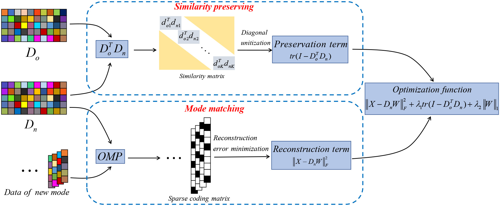

图 3. 模式匹配与相似性保持字典学习框架。框架包括用于学习新知识的重构项和用于通过保持模型更新前后相似性来消除旧知识遗忘的保持项。

为实现模式匹配，字典需要很好地表征新数据，即 Xn 约等于 DnW。与传统字典学习相同，定义重构项 ||Xn - DnW||^2_F，通过最小化重构误差确保 Dn 对 Xn 的表征能力。此外，字典需要保持表征旧数据的能力，但在更新字典时不再使用旧数据。由于 Do 可以表征旧数据，我们在训练 Dn 时保持 Dn 与 Do 足够相似，以确保 Dn 对旧数据的表征能力，实现相似性保持。

因此，JMSDL的优化目标函数为：

min {||Xn - DnW||^2_F + lambda1*||Do^T * Dn - I||^2_F + lambda2*||W||_1} 其中第一项为重构项，实现模式匹配；第二项为保持项，实现相似性保持；第三项为稀疏约束项。lambda1 和 lambda2 为正则化参数。通过交替优化 Dn 和 W 来求解该优化问题。

3. 优化算法

采用交替优化策略求解JMSDL的优化问题：

步骤1：固定 W，更新 Dn。通过求解子优化问题，利用矩阵分解和逐元素更新公式得到新的字典 Dn。

步骤2：固定 Dn，更新 W。使用正交匹配追踪(OMP)方法求解稀疏编码矩阵 W。

两个步骤交替迭代，直到达到迭代次数或满足收敛条件。

- 3 -

<!-- Page 4 -->

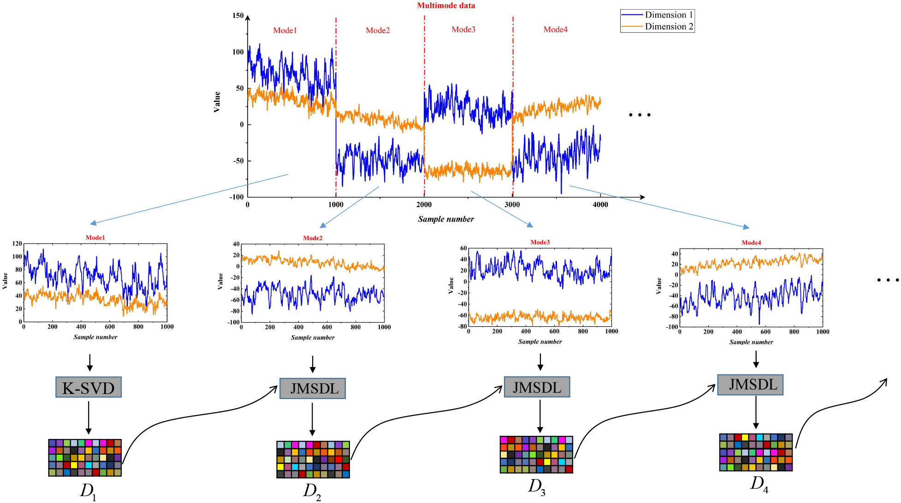

图 4.

字典更新步骤。首先使用模态1的数据基于K-SVD方法获得D1；然后使用模态2的数据和D1基于JMSDL方法获得D2；依次获得D3和D4。该字典更新过程可在 收集到新模态数据后持续进行。

字典使用JMSDL方法进行更新。每次更新过程中，字典自适应学习一个新模态。共收集 s 个历史模态。对于第一个模态，使用K-SVD方法学习初始字典；对于其余 s-1 个模态，依次使用所提JMSDL方法更新字典 s-1 次。与传统多模态方法相比，所提方法实现了模型的自适应更新，以适应实际工业过程中不断出现的新模态。此外，增量更新机制大大 节省了训练资源。

B. 在线监控

1. 控制限计算

在在线监控阶段，使用训练好的字典监控工业过程状态。模型中的其他变量(如W)不需要存储。当在线数据到达时，使用字典重构数据 ，并根据重构误差的大小判断数据是正常还是故障。

计算每个训练样本的重构误差 Ri = ||xi - Dc*wi||^2_2，然后使用核密度估计(KDE)方法计算控制限 Rtr。选择适当的置信水平 alpha，即可获得控制限。由于JMSDL方法训练的字典对所有模态的正常数据具有相同的表征能力，不同模态的重构误差大小保持在同一 水平。当新模态到达并更新 Dc 时，重新计算重构误差并通过KDE方法更新控制限。Dc 的更新与控制限的更新同步进行。

2. 在线数据监控

当在线监控数据 x_new 到达时，我们不需要知道数据的模态标签，直接使用字典 Dc 重构数据，因为它对所有已学习模态具有平等的表征能力。基于稀疏表示模型，使用OMP方法计算稀疏编码 w_new，然后得到重构结果 x_hat_new = Dc*w_new，进而计算在线数据的重构误差 IRE_new = ||x_new - x_hat_new||^2_2。

通过计算在线数据的IRE进行过程监控。字典已学习了训练数据的特征，因此知道如何表征这类数据。如果在线数据与用于训练的正常 数据属于同一类，则也能被字典很好地重构，其IRE将较小。故障数据与正常训练数据不同，无法被字典很好地重构，因此其IRE将较大 。当IRE超过控制限时，判定当前在线数据为故障数据。否则，数据为正常。

## III. 实验结果与分析

本节通过数值仿真实验和CSTH仿真实验来验证所提JMSDL方法的优越性。首先定义一些指标来定量评估方法的优越性。

字典相似度 ds：定量评估旧字典与更新后字典之间的相似性，ds 的值在0到1之间，越接近1表示两个字典越相似。

平均重构误差 MRE：定量评估字典对各模态数据的表征能力，MRE越小表示字典对该模态的重构能力越强。

故障检测率 FDR = tp / 故障数据总数 x 100% 误报率 FAR = fp / 正常数据总数 x 100% 为验证所提方法的优越性，选择了四种先进的过程监控方法进行比较：PCA混合模型(mPCA)方法、传统字典学习(DL)方法、LCDL方法和O

- 4 -

<!-- Page 5 -->

DL方法。

A. 数值仿真实验

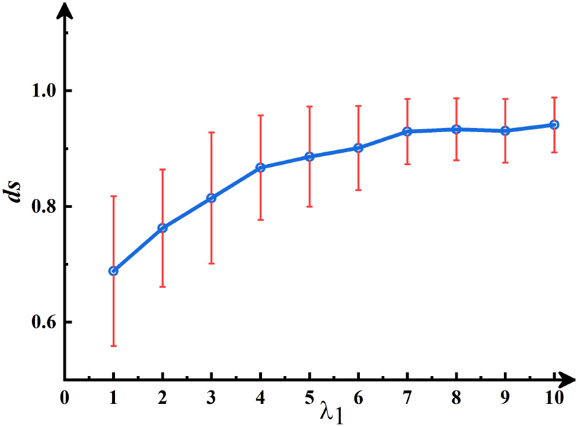

图 5. 不同lambda1对ds的影响。lambda1的增大促进新字典与旧字典更加相似。

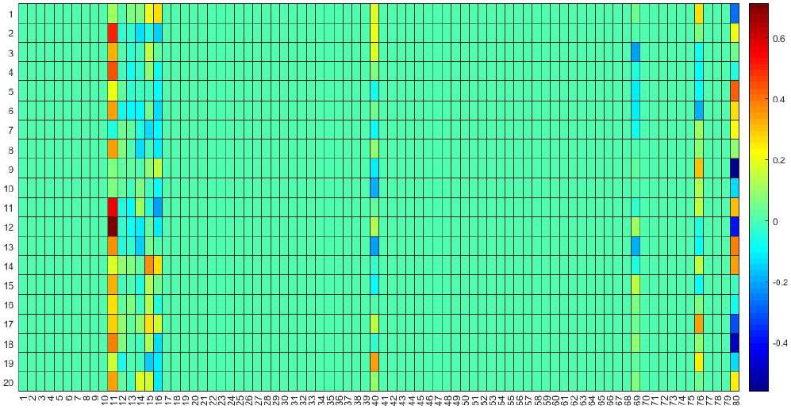

图 6. (Do-Dn)的热力图。字典更新时，少量原子被重写(表示新知识)，大部分未改变的原子用于保持旧知识。

首先验证优化算法的可行性，使用数值仿真数据检验JMSDL方法表征多模态数据的能力。实验过程可分为三个步骤：

1. 数据生成：使用四个不同的随机矩阵 A1 至 A4 生成四个模态的数据。每个模态有1000个训练样本和250个测试样本。
2. 模型训练：首先使用模态1的数据基于K-SVD方法获得 D1；然后使用模态2的数据和 D1  基于JMSDL方法获得 D2；依次获得 D3  和
- 5 -

<!-- Page 6 -->

D4。

3. 数据表征：分别获得 D1 至 D4 后，使用四个字典表征测试数据集，计算每个字典对各模态的MRE。

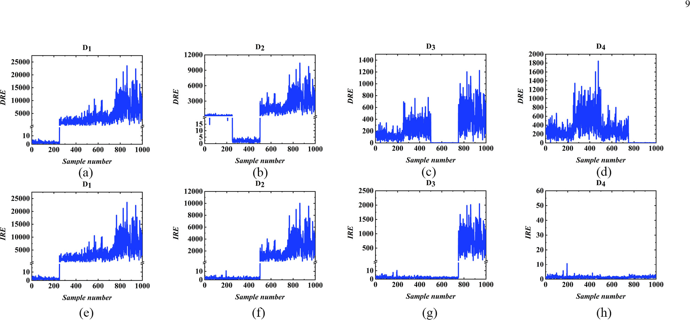

图 7. 不同字典对数值仿真测试数据的表征效果比较。(a)-(d) DL方法连续学习四个模态时测试数据上的DRE统计量。(e)-(h) JMSDL方法连续学习四个模态时测试数据上的IRE统计量。所提方法避免了传统字典学习面临的灾难性遗忘问题。

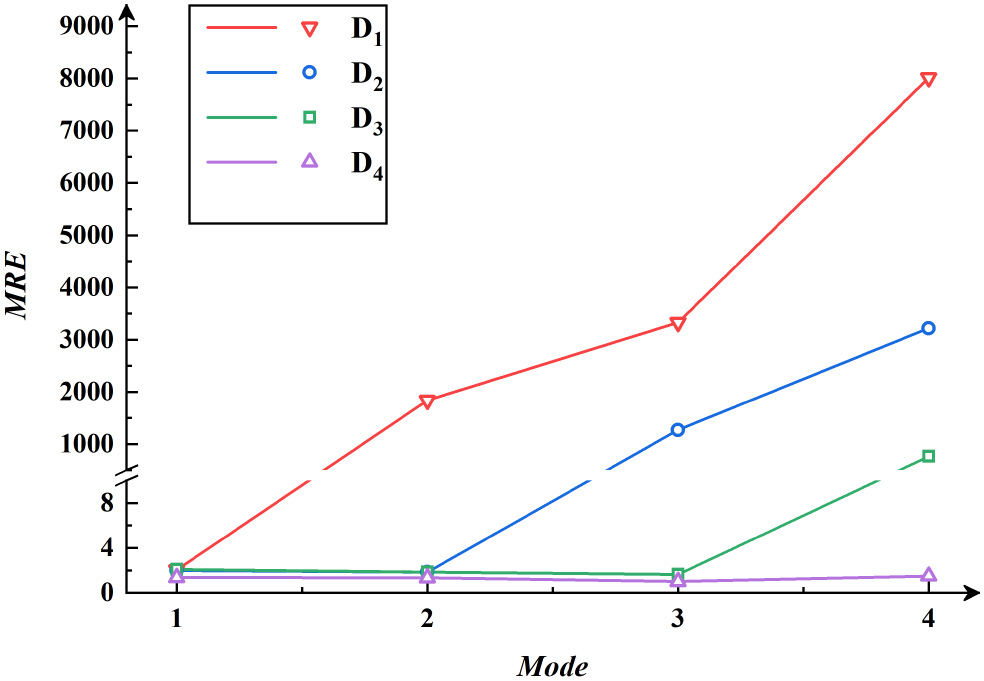

图 8. 四个字典对数值仿真数据四个模态的平均重构误差。MRE越小，对该模态的表征越好。JMSDL能够持续学习新模态并保持对先前模态的小MRE。

实验参数设置：每个字典大小相同，字典原子数为80。模态1的稀疏度为3，lambda1 为2.5。结果表明，JMSDL方法能够在学习新模态的同时保持对历史模态的低MRE，有效避免了灾难性遗忘问题。

- 6 -

<!-- Page 7 -->

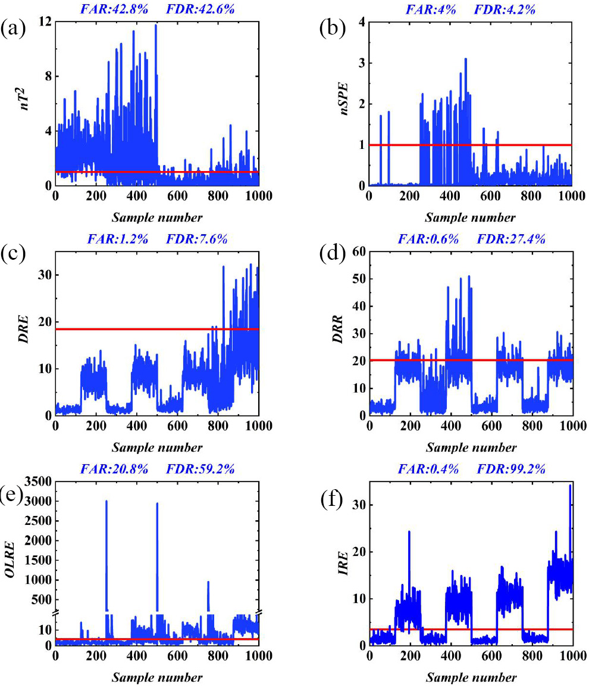

图 9. 不同方法对数值仿真数据的过程监控效果。(a) mPCA方法的nT2统计量。(b) mPCA方法的nSPE统计量。(c) DL方法的DRE统计量。(d) LCDL方法的DRR统计量。(e) ODL方法的OLRE统计量。(f) 所提JMSDL方法的IRE统计量。

在过程监控实验中，使用 D4 监控该多模态数值仿真过程。在测试数据中，对每个模态的最后125个数据添加偏置故障。因此测试数据中有500个正常样本和500个故 障样本。结果表明，所提JMSDL方法能够很好地区分正常数据和故障数据，具有良好的过程监控效果。

B. CSTH仿真实验

- 7 -

<!-- Page 8 -->

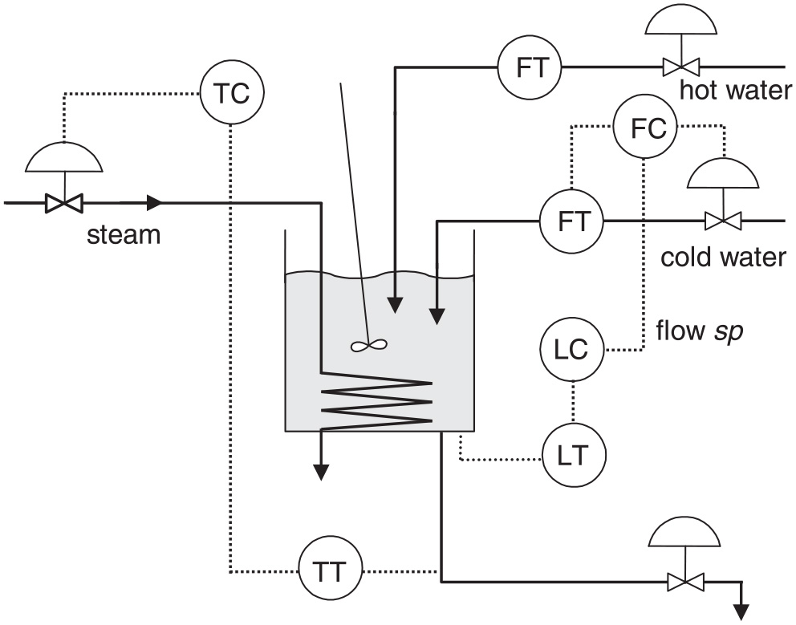

图 10. CSTH过程示意图。

CSTH过程是一个广泛使用的工业过程基准。本实验使用CSTH仿真系统生成三个模态。每个模态有1000个正常样本作为训练数据，250个 正常样本作为测试数据。首先使用K-SVD方法训练模态1的数据获得 D1，原子数为80，稀疏度为4。然后基于JMSDL方法使用模态2的数据将字典更新为 D2，lambda1 为0.05。再使用模态3的数据将字典从 D2 更新为 D3，lambda1 为0.28。

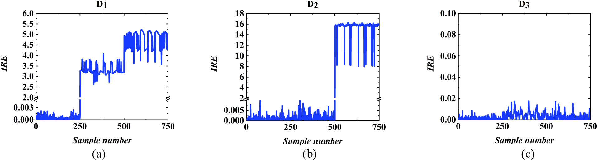

图 11. 不同字典对CSTH过程测试数据的表征效果。(a) D1对测试数据的IRE。(b) D2对测试数据的IRE。(c) D3对测试数据的IRE。JMSDL能够持续学习CSTH的多模态数据而不会发生灾难性遗忘。

使用这三个字典表征测试数据，D1 只能表征模态1；D2 能表征模态1和模态2；D3 能表征所有三个模态。每次用新模态更新字典都降低了该模态的重构误差，同时保持了字典对先前学习模态的表征能力。该实验验证了 JMSDL方法能够适应新模态而不会发生灾难性遗忘。

- 8 -

<!-- Page 9 -->

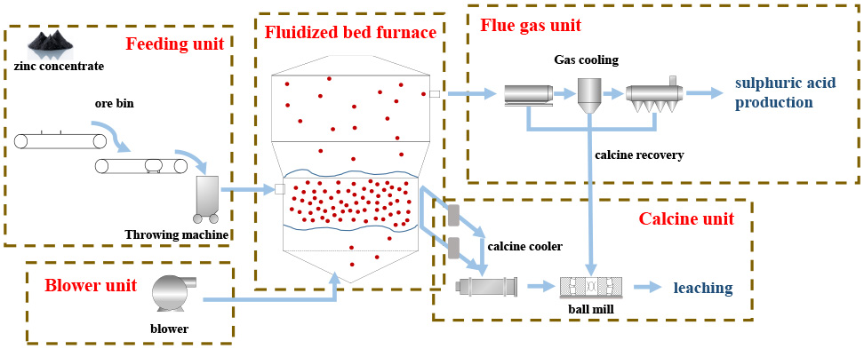

图 12. 不同方法对CSTH过程数据的过程监控效果。(a) mPCA方法的nT2统计量。(b) mPCA方法的nSPE统计量。(c) DL方法的DRE统计量。(d) LCDL方法的DRR统计量。(e) ODL方法的OLRE统计量。(f) 所提JMSDL方法的IRE统计量。

在过程监控实验中，设置了三种故障情况。mPCA方法只能检测温度上的乘性故障；DL方法无法检测液位上的偏置故障；LCDL方法无法检 测流量上的乘性故障；ODL方法对新模态数据有较大的重构误差。所提JMSDL方法对每个模态的正常数据具有相同的表征能力，因此在CS TH过程上具有最佳的监控效果。

## IV. 工业焙烧过程应用

- 9 -

<!-- Page 10 -->

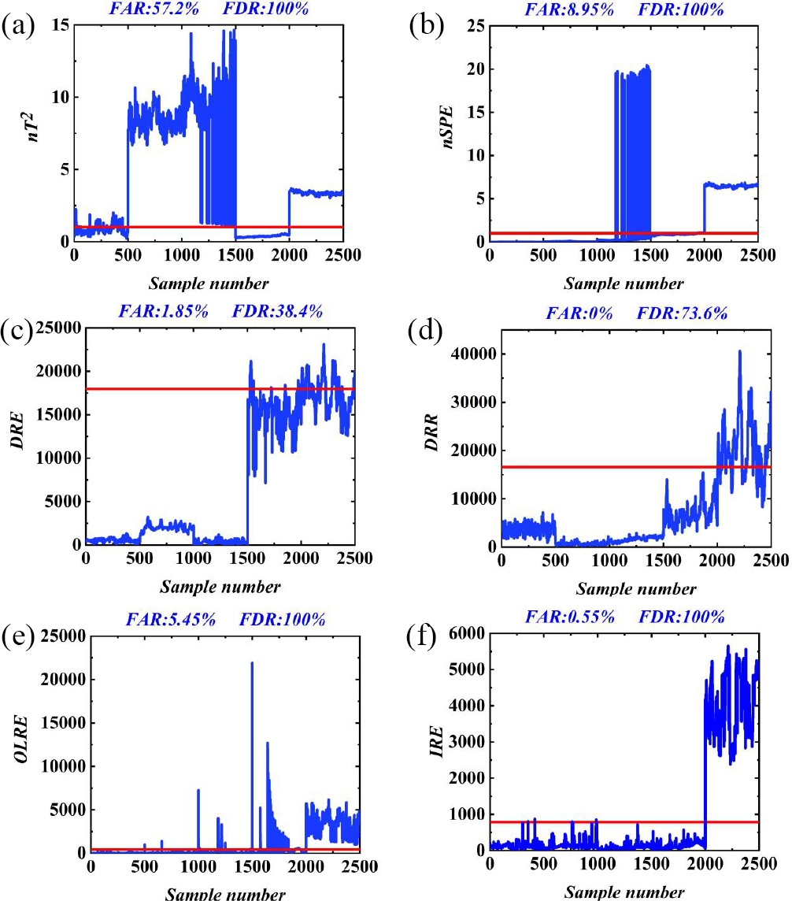

图 13. 焙烧过程结构图。

为验证所提JMSDL方法在实际工业过程中的可行性，我们在中国湖南省某锌冶炼厂的实际焙烧过程上进行了实验。焙烧是锌冶炼过程的 第一步。焙烧过程的稳定安全运行对于减少工业污染和确保产出锌的质量至关重要。焙烧过程的主要功能是在焙烧炉中高温氧化原矿， 使不溶性硫化锌转化为可溶于弱酸的氧化锌，产出物料锌焙砂被运输到后续的浸出工序。

我们采集了焙烧过程的25维变量数据，包括焙烧炉中多个位置的温度、流量和压力。通过分析这些物理量的大数据，可以提取焙烧过程 的潜在特征。选取四种工况的数据作为正常数据：高效条件为模态1，高效过分解条件为模态2，高效欠氧化条件为模态3，健康条件为 模态4。

使用模态1的数据训练初始字典 D1，原子数为50，稀疏度为3。然后依次使用模态2、3和4的数据更新字典，分别获得 D2、D3 和 D4。每次使用JMSDL方法时，lambda1 分别为10、10和6。所有字典的稀疏度为3。

- 10 -

<!-- Page 11 -->

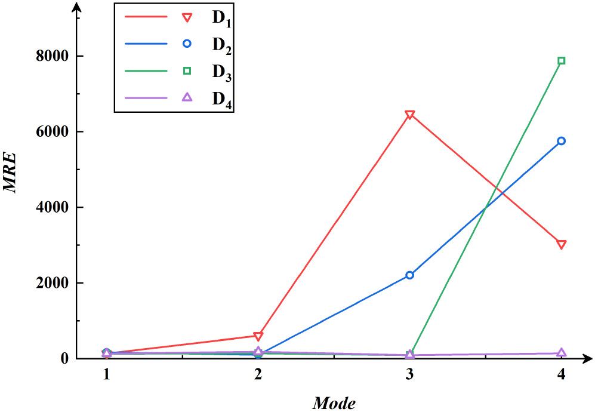

图 14. 不同字典对焙烧过程测试数据的表征效果。(a) D1对测试数据的IRE。(b) D2对测试数据的IRE。(c) D3对测试数据的IRE。(d) D4对测试数据的IRE。

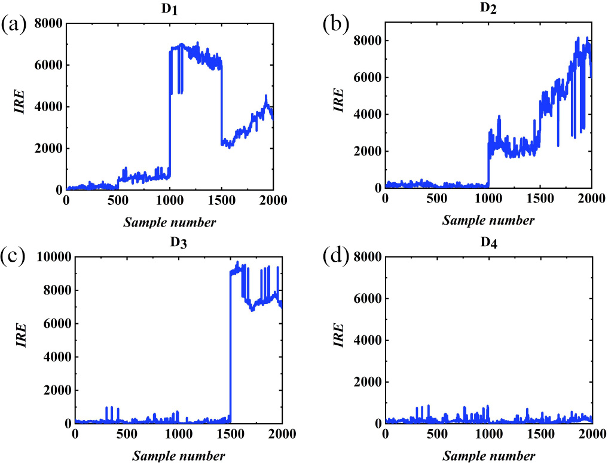

图 15. 四个字典对焙烧过程数据四个模态的平均重构误差。对于焙烧过程，JMSDL能够持续学习新模态并保持对先前模态的小MRE。

- 11 -

<!-- Page 12 -->

实验结果表明，更新后的字典能够表征当前模态的数据以及先前模态的数据，所有已训练模态的重构误差保持在同一水平。学习新模态 后，字典对该模态的MRE迅速下降，因此 D4 对所有模态数据都有较小的重构误差。实验结果表明JMSDL方法在焙烧过程中不会导致灾难性遗忘，验证了所提方法在实际工业过程中 的实用性。

在过程监控实验中，使用高效床层沉积条件作为故障条件，在测试数据末尾添加500个故障数据，共2500个测试样本。mPCA方法能有效 监控故障，但不能很好地表征某些模态。DL方法无法表征模态4，导致FDR很低。LCDL方法对各模态有不同的重构误差水平，导致控制限 较高。ODL方法容易发生灾难性遗忘。所提JMSDL方法在焙烧过程上取得了最佳的监控效果。

## V. 结论

在多模态过程中，技术和策略等因素的变化往往导致新模态的产生，使监控模型经常表现不佳。同时，用新模态数据更新模型可能导致 灾难性遗忘，使历史模态的表征效果变差。为解决这些问题，本文开发了一种基于JMSDL的自适应多模态过程建模和监控方法。首先使 用字典学习方法建立初始模型。当新模态产生时，通过所提JMSDL方法更新模型，使模型持续适应新模态，同时保持对历史数据的表征 能力。

基于数值仿真、CSTH过程和焙烧过程的实验表明，该模型能够在不发生灾难性遗忘的情况下适应新模态，所提方法显著优于现有方法。

值得一提的是，JMSDL方法是一种有监督方法，这是我们的局限性之一。此外，在下一步工作中，我们将进行更细粒度的处理，例如考 虑每个原子之间不同程度的相似性，以进一步改进这项工作。

## 参考文献

[1] J. Liu 等, 使用堆叠稀疏去噪自编码器和Softmax分类器进行复杂工业过程的鲁棒故障识别, IEEE Trans. Cybern., 2021.

[2] W. Yu, C. Zhao, B. Huang, MoniNet: 用于工业过程故障检测的时间和空间信息并发分析, IEEE Trans. Cybern., 2021.

[3] J. Yu, X. Yan, 基于深层置信网络隐藏层不稳定神经元输出信息的全过程监控, IEEE Trans. Cybern., 2020.

[4] J. Zhang 等, 改进的概率PCA混合模型用于非线性数据驱动过程监控, IEEE Trans. Cybern., 2019.

[5] P. Goodall 等, 使用电力和机械模型进行刀具状态监控的网络物理系统, Comput. Ind., 2020.

[6] D. Gorinevsky, 数据驱动多变量过程监控中的故障隔离, IEEE Trans. Control Syst. Technol., 2015.

[7] J. Jiang, Q. Jiang, 变分贝叶斯概率建模框架用于数据驱动分布式过程监控, Control Eng. Pract., 2021.

[8] W. Li 等, 递归PCA用于自适应过程监控, J. Process Control, 2000.

[9] S. Yin, G. Wang, H. Gao, 基于修正正交分解的数据驱动过程监控, IEEE Trans. Ind. Electron., 2019.

[10] C. Zhao, F. Gao, 基于分层聚类和PCA的多模态过程监控, Ind. Eng. Chem. Res., 2014.

## 作者简介

黄珂珂 2012年获东北大学自动控制学士学位，2017年获清华大学控制科学与工程博士学位。2017年4月至2021年9月任中南大学副教授，现为中 南大学自动化学院教授。研究方向包括工业大数据、过程监控与控制、网络科学。

陶醉 2021年获中南大学自动化学士学位，现于中南大学攻读控制科学与工程硕士学位。研究方向包括字典学习和过程监控。

刘逸孙 2017年获中南大学自动控制学士学位，现于中南大学攻读控制科学与工程博士学位。研究方向包括过程监控、机器学习和供应链优化。

孙蓓 2015年获中南大学控制科学与工程博士学位。2012年至2014年在纽约大学理工学院电气与计算机工程系工作。现为中南大学副教授。研 究方向包括数据驱动建模、有色金属冶金过程优化与控制。

杨春华 1988年和2002年分别获中南大学自动控制工程硕士和控制科学与工程博士学位。1999年起任中南大学信息科学与工程学院教授，现为自 动化学院院长。研究方向包括复杂工业过程建模与优化控制、智能控制系统。

桂卫华 1976年和1981年分别获中南大学电气工程学士和自动控制工程硕士学位。2013年起为中国工程院院士。现任职于中南大学自动化学院。

- 12 -

<!-- Page 13 -->

研究方向包括复杂工业过程建模与优化控制、故障诊断、分布式鲁棒控制。

胡石岩 2008年获美国德克萨斯A&M大学金斯维尔分校计算机工程博士学位。现为英国南安普顿大学教授、网络物理系统安全系主任。研究方向 包括网络物理系统和网络物理系统安全。

- 13 -
