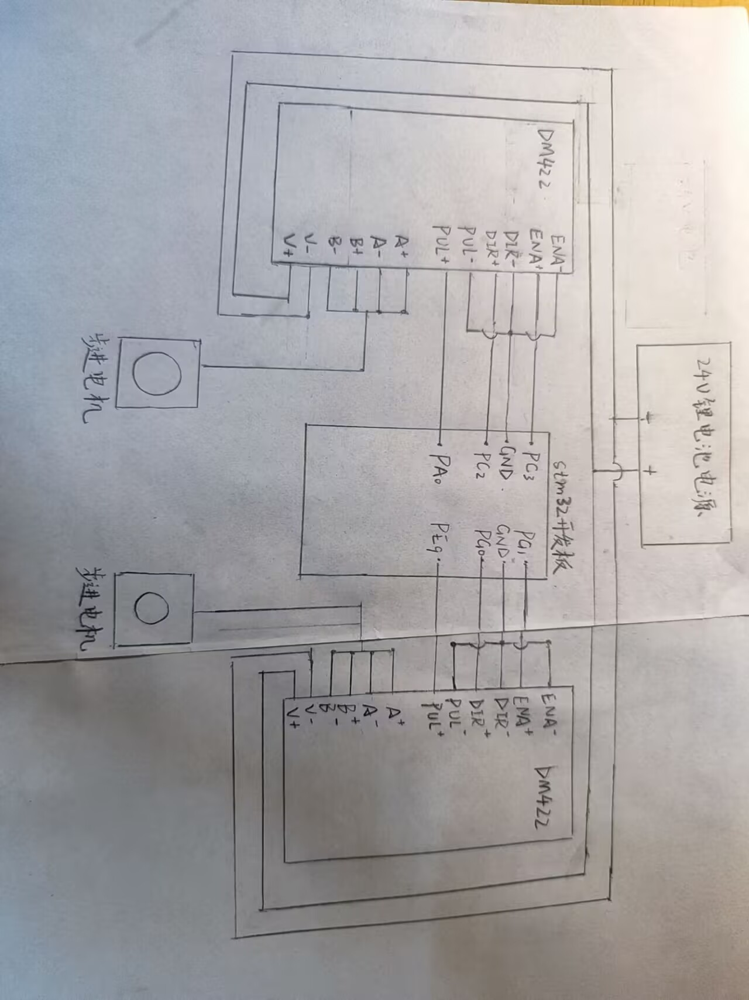

电路连接图

__一、标题：步进电机控制系统组成与工作原理 __

这个系统是一套「精准位置控制系统」，核心作用是让电机按照设定的步数、速度和方向，实现高精度的旋转运动。 

核心组成部件及功能：

 \- 电源（电池）：为驱动器提供稳定的24V直流电压

\- 步进电机驱动器：接收控制信号，放大电流并驱动步进电机转动，是连接控制信号与电机动力的桥梁。 

\- 步进电机：将电脉冲信号转化为机械转动，实现精准的角度控制。

\- STM32开发板：作为控制单元，生成并发送控制信号给驱动器，决定电机的转速、转向和转动步数。

__二、系统整体工作流程：__ 

1\.电池为驱动器提供24V稳定电源。

2\.STM32开发板上电运行程序，通过GPIO输出脉冲（PUL）和方向（DIR）信号给驱动器。

3\.驱动器接收信号后，按照设定的电流和细分，给步进电机的线圈供电。 

4\. 电机在旋转磁场的作用下，按设定的方向和速度转动，实现精准的机械运动。

1. __现存问题及改进方向__

当前系统现存问题：

1\. 线材杂乱：电机\+驱动器后，电源线、信号线、电机线数量暴增，无规整布局，易短路、接触不良、排查困难。

2\. 共地/供电隐患：24V电池直接并联多台驱动器，无保护、无滤波，电压波动易导致电机抖动、驱动器报警。

3\. STM32引脚不足：6台电机需要6路脉冲\+6路方向，共12个IO口，直接占用大量引脚，扩展受限。

4\. 无转接板，接线繁琐：每台驱动器单独接线，后期调试、更换电机极麻烦。

改进方向及解决方案：

现阶段（2电机）

\- 暂时不用做PCB转接板，用面包板/接线端子排简易转接，整理现有杜邦线，让线不乱。

\- 保持现有接线方式不变，保证稳定运行。

 

后续（扩展到4–6电机）

\- 设计简易PCB转接板，集中电源、信号、共地，解决线材杂乱。

\- 加入IO扩展芯片，预留电机扩展位。

 

终期

\- 增加限位开关、急停、独立保险，做完整运动控制系统。

 

 

目前系统已经基本稳定，不需要修改共地/接线逻辑，后期升级只做集中规整\+IO扩展，加转接板是为了不乱线、好维护、方便扩展多电机，不会影响现有稳定性。

