# Industrial_Process_Modeling_and_Monitoring_Based_on_Jointly_Specific_and_Shared_Dictionary_Learning

IEEE TRANSACTIONS ON INSTRUMENTATION AND MEASUREMENT, VOL. 71, 2022 3500111

## Industrial Process Modeling and Monitoring Based

## on Jointly Specific and Shared Dictionary Learning

, *Member,* *IEEE*, Zui Tao , *Senior* *Member,* *IEEE*, and Weihua Gui Keke Huang , Bei Sun , Chunhua Yang some advanced data analysis methods. The widespread use ***Abstract *—With** **the** **development** **of** **industrial** **cyber–physical** **systems** **(ICPS),** **data** **of** **industrial** **processes** **are** **collected** **and** of ICPS in industrial processes has made process monitoring **used** **for** **data-driven** **process** **monitoring.** **However,** **due** **to** **the** increasingly convenient and efficient.

**variation** **of** **working** **conditions,** **the** **data** **samples** **are** **always** As the production process becomes increasingly complex, **featured** **by** **characteristics** **and** **commonalities.** **Generally,** **in** a small fault may cause incalculable damage to the whole **industrial** **process** **data,** **characteristics** **are** **sparse,** **and** **common-** system [3], [4]. Process monitoring can obtain the real-time **alities** **are** **strongly** **correlated.** **The** **presence** **of** **characteristics** **hampers** **the** **feature** **extract** **of** **industrial** **data,** **thus** **further** status of the production process, and when abnormalities are **bringing difficulties to process monitoring. To solve** **this problem,** monitored to occur, an alarm can be triggered to eliminate **this** **article** **proposes** **a** **jointly** **specific** **and** **shared** **dictionary** safety hazards and reduce economic losses. As a result, process **learning** **(JSSDL)** **method.** **Specifically,** **we** **first** **build** **a** **specific** monitoring is significant to maintain the stable and safe **dictionary** **and** **a** **shared** **dictionary** **to** **reconstruct** **characteristics** operation of industrial production. Generally, process moni- **and** **commonalities** **feature,** **respectively.** **Then,** **considering** **the** **sparsity** **of** **characteristics** **and** **the** **strong** **correlation** **of** **com-** toring methods include model-based methods and data-driven **monalities,** **we** **add** **sparsity** **constraints** **to** **specific** **dictionaries** methods. The former builds the model of industrial process **and** **low-rank** **constraints** **to** **a** **shared** **dictionary.** **After** **that,** based on the first principle of the industrial process; the **an** **iterative** **optimization** **algorithm** **is** **proposed** **to** **optimize** **the** latter monitors the industrial process based on extracting the **two** **dictionaries.** **When** **online** **data** **samples** **arrive,** **we** **use** **the** underlying features from the measurement data. Data-driven **two** **dictionaries** **to** **reconstruct** **the** **data** **and** **determine** **the** **data** **that** **are** **normal** **or** **faulty** **according** **to** **the** **reconstruction** **error.** methods without the need of exact first principle knowledge **To** **verify** **the** **superiority** **of** **the** **proposed** **JSSDL** **method** **in** so that they are suitable for modern complex industrial systems **process monitoring, we do extensive experiments. The experimen-** and, thus, have been widely studied and applied [5], [6].

**tal** **results** **demonstrate** **that** **the** **proposed** **method** **can** **achieve** Typical data-driven methods include principal component **satisfactory** **monitoring** **results** **compared** **with** **several** **state-of-** analysis (PCA), partial least squares (PLSs), [7], [8], and so **the-art** **methods.** on. Recently, with the development of artificial intelligence, ***Index*** ***Terms *—Dictionary** **learning,** **low-rank** **and** **sparse,** some machine learning and deep learning methods have been **process** **monitoring,** **shared** **dictionary,** **specific** **dictionary.** used for industrial process modeling and monitoring, such as the slow feature analysis method [9], the Bayesian analysis I. INTRODUCTION method [10], and the neural network method [11]. Recently,

# W

ITH the rapid development of information technolo- there have been some important advances in the field of gies, the information interaction between production process monitoring. Si *et* *al.* [12] first proposed a pioneering processes and cyberspace is increasingly intensive, which method to accurately decompose measurements into KPI- promotes the application of industrial cyber–physical systems related and KPI-unrelated parts, which achieves excellent (ICPS) [1], [2] in industrial processes. Generally, a complete performance in nonlinear process monitoring. Chen *et* *al.* [13] ICPS consists of two layers: the physical layer and the proposed a just-in-time-learning-aided canonical correlation cyberspace layer. In the physical layer, the factory completes analysis method for multimode process monitoring and solved production equipment operating and product manufacturing.

the limitations of CCA in handling processes with multiple In cyberspace, the data is collected and stored, and monitor- operating points. Dong and Qin [14] considered the dynamic ing of the state of industrial processes is accomplished by features of the data and proposed a novel dynamic PCA algorithm to extract explicitly a set of dynamic latent variables Manuscript received August 19, 2021; revised September 27, 2021; accepted with which to capture the most dynamic variations in the data.

October 28, 2021. Date of publication November 8, 2021; date of current Jiang *et* *al.* [15] proposed a distributed computing framework version February 21, 2022. This work was supported in part by the National Natural Science Foundation of China under Grant 62073340 and Grant of local–global modeling for nonlinear plant-wide process 61860206014; in part by the National Key Research and Development monitoring. These works have contributed to the development Program of China under Grant 2019YFB1705300; in part by the Innovation- of process monitoring by proposing innovative and effective Driven Plan in Central South University, China, under Grant 2019CX020; and in part by the 111 Project, China, under Grant B17048. The Associate Editor solutions that address different problems in the field of process coordinating the review process was Dr. Gaigai Cai. *(Corresponding* *author:* monitoring.

*Bei* *Sun.)* As an efficient machine learning method, dictionary learn- The authors are with the School of Automation, Central South University, Changsha 410083, China (e-mail:

huangkeke@csu.edu.cn;

ing, which represents the data as a linear combination of taozui18@csu.edu.cn;

sunbei@csu.edu.cn;

ychh@csu.edu.cn;

gwh@csu.

atoms, has been fully developed and applied. Due to its edu.cn).

good generalization and data representation ability, dictionary Digital Object Identifier 10.1109/TIM.2021.3125969 1557-9662 © 2021 IEEE. Personal use is permitted, but republication/redistribution requires IEEE permission.

See https://www.ieee.org/publications/rights/index.html for more information.

<!-- Page 2 -->

3500111 IEEE TRANSACTIONS ON INSTRUMENTATION AND MEASUREMENT, VOL. 71, 2022

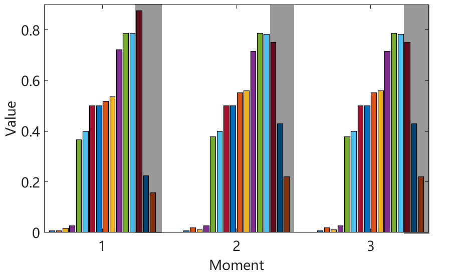

moments. The standard deviation of the last three dimensions is relatively large. We assume that there are a few compo- nents with large variations in the data at different moments.

Furthermore, we define strongly similar components in the data as commonalities and components with large variations as characteristics.

Based on the above in-depth analysis of industrial data, we are inspired and developed assumptions about industrial data. We assume that complex industrial process data can be decomposed into commonalities and characteristics. Common- alities feature is strongly correlated, and characteristics feature is sparse. In these assumptions, we decompose industrial Fig. 1.

Visual interpretation of the existence of characteristics and common- process data into two components: commonalities and charac- alities in industrial data. There are three moments of data in total.

teristics, which correspond to some common information and unique information in a set of industrial data, respectively.

Commonalities are similar because they represent common learning has been widely used in image processing, pattern information in industrial data, and therefore, commonalities recognition [16], and so on. Dictionary learning has been feature behaves as strong correlations. Characteristics repre- continuously developed to achieve better feature representation sent unique information in industrial data, which are generally performance, such as the label consistent K-SVD method [17], sparse because unique information appears in a few dimen- the supervised dictionary learning method [18], and the dis- sions of the data.

criminative K-SVD method [19]. Likewise, dictionary learning When traditional machine learning methods are used to is also applicable to process monitoring. Ren and Lv [20] pro- monitor this kind of data, such as in Fig. 1, it may incorrectly posed a fault detection method for semiconductor manufactur- regard normal data at moment 1 as a fault. The misjudg- ing processes based on dictionary learning. Huang *et* *al.* [21] ment occurs because of the presence of characteristics in proposed a multimode process monitoring method based on moment 1. It is obvious that, in this case, some traditional structured dictionary learning and got good results in the alu- methods are no longer applicable. Certainly, some studies have minum electrolysis industry. Huang*et al.*[22] presented a dis- taken these problems into account and proposed solutions.

criminative dictionary learning for high-dimensional process Since characteristics exist only in a few dimensions, these monitoring.

methods consider the characteristics as sparse outliers, use Although the abovementioned methods work well for data some robust approaches to remove them, and then train the representation, there are still some difficulties when it is model with a data-driven method, such as robust PCA and applied to some complex industrial process monitoring. Based robust dictionary learning [23]. However, there are also some on an in-depth analysis of industrial data, we believe that problems with these methods. First, these methods remove the industrial data consist of commonalities and characteristics.

characteristics in training data as outliers and consider only the Ideally, industrial data would be strongly correlated because of commonalities, which causes it cannot learn the characteristics the presence of commonalities. However, due to the variation feature of the data, so the performance of process modeling of working conditions, industrial process data always have the and monitoring is limited. Second, these methods many even feature of characteristics, which are pervasive and different face the problem of whether to remove the characteristics from from each other. In addition, since the characteristics features online monitoring data. If not removed, these methods tend to are not particularly remarkable, they may affect only a few treat the characteristics in normal data as faults, which causes dimensions of raw data. To illustrate the situation vividly, a high false alarm rate (FAR). However, if removed, it may we analyze a dataset of real industrial processes. After normal- remove the faults of the faulty data as characteristics and, thus, izing the data, we use three consecutive moments and draw further reduce the fault detection rate (FDR).

the bar chart, as shown in Fig. 1. There are three clusters Motivated by the situation that industrial data often have in Fig. 1, for each representing one moment of data. The both characteristics and commonalities feature, this article pro- data at one moment have 16 dimensions and a dimension poses a jointly specific and shared dictionary learning (JSSDL) representing industrial data collected on a sensor. We measure method, which builds a specific dictionary and a shared the similarity between the data of different moments based dictionary, respectively, for characteristics and commonalities on the standard deviation of each dimension. The standard feature simultaneously, and solves the process modeling and deviations of the first 13 dimensions are less than 0.02. For monitoring problem of the industrial site under the framework the last three dimensions, they are 0.0722, 0.1178, and 0.0366, of ICPS. The main contribution points of this article are given which are much larger than the first 13 dimensions. A larger as follows. First, a task-oriented process monitoring method standard deviation indicates a larger variation in a dimension is proposed to consider the existence of both characteristics of different moments. By analyzing the standard deviations, and commonalities in industrial data, which is applicable to it can be found that the first 13 dimensions of different a wide range of industrial processes. Second, the proposed moments are virtually unchanged. Therefore, we assume that JSSDL method has a good modeling capability. Since the there are strongly similar components in the data at different sparsity of specific dictionaries and sizes of two dictionaries

<!-- Page 3 -->

HUANG *et* *al.*: INDUSTRIAL PROCESS MODELING AND MONITORING BASED ON JSSDL 3500111 can be adjusted, it has good data representation capability for monitoring. First, we establish a mathematical model for various complex data. Finally, through the analysis of indus- industrial data elaborately. Then, a novel optimization algo- trial process data, we verified the existence of characteristics rithm is designed to train the model. Finally, we use learned and commonalities. The superiority of the proposed method dictionaries to reconstruct the online data and perform process for process monitoring is verified by compared with some monitoring tasks. The framework of the proposed JSSDL traditional methods.

method for process monitoring is shown in Fig. 2.

The rest of this article is structured as follows. In Section II, *1)* *Off-Line* *Modeling:* According to the assumptions, the industrial data can be modeled as follows:

the process data modeling, optimization algorithm, and steps of process monitoring are given. In Section III, three experi- *Y* =*Y*1+*Y*2 (4) ments are given to illustrate the effectiveness of the proposed method. Finally, the conclusion is given in Section IV.

where *Y* denotes the raw data, *Y*1 denotes the characteristics, and*Y*2 denotes the commonalities. Based on the characteristics II. METHODOLOGY and commonalities feature, *Y*1 is a sparse matrix, and the columns of *Y*2 are strongly correlated with each other.

*A.* *Basics* *of* *Dictionary* *Learning* When only the characteristics *Y*1 are considered, use The philosophy of dictionary learning is to linearly represent the specific dictionary *D*1 to represent *Y*1. Mathematically, data by a small number of dictionary atoms, and the atoms are *Y*1 ≈*D*1*X*1. *X*1 is the sparse coding matrix. According to the the columns of the dictionary matrix. Mathematically, characteristics feature, most elements in*Y*1 are 0. In traditional *Y* ≈*DX* dictionary learning, each element of data reconstructed by dic- (1) tionary atoms is a nonzero value. Although the reconstruction where *Y* ∈*R**n*×*m*, *D* ∈*R**n*×*k*, and *X* ∈*R**k*×*m* denote the error is guaranteed to be small, the sparsity of the data cannot data sample matrix, the dictionary, and the sparse coding, be reconstructed, which is obviously unreasonable. Therefore, respectively. *n* denotes the dimensionality of the data sample, sparsity constraint should be added to dictionary learning to *m* denotes the number of samples, and *k* denotes the number ensure that dictionary atoms can extract the sparse feature of of atoms. To train the dictionary from the data samples, the data. The improved optimization problem is formulated as the optimization problem of dictionary learning is defined as follows:

follows:

∥*Y*1−*D*1*X*1∥2  *F* +*λ*1∥*X*1∥1 +*λ*2∥*D*1∥1 (5) min *D**,**X* ∥*Y* −*DX*∥2 s.t. ∀*i**,* ∥*x**i*∥0 ≤*T*0 *F**,* (2) min *D*1*,**X*1 where *D*1 denotes the specific dictionary. An *L*1 norm con- where ∥*Y* −*DX*∥2 *F* is the reconstruction error term, which straint to *D*1 can ensure the sparsity of the learned dictionary.

ensures the representation capabilities of dictionaries to data.

When a small number of atoms are used to reconstruct the ∥· ∥*F* denotes the Frobenius norm of the matrix. If *A* =  characteristics, the sparsity of the data can be maintained while  [*a**i j*]*m*×*n*, ∥*A*∥*F* = *i**,**j* *a**i j*. *x**i* denotes the *i*th column of minimizing reconstruction error.

sparse coding *X*. The constraint of *L*0 norm ensures the When only the commonalities *Y*2 are considered, use sparsity of the matrix. ∥*x**i*∥0 indicates that few atoms should the shared dictionary *D*2 to represent *Y*2. Mathematically, be used for data representation. Specifically, by approximately *Y*2 ≈*D*2*X*2. *X*2 is the sparse coding matrix. The strong replacing *L*0 norm by the *L*1 norm, the constrained opti- correlation of *Y*2 makes *D*2 to be low-rank. Therefore, a low- mization problem can be transformed into an unconstrained rank constraint should be added on *D*2. Accordingly, the optimization problem as follows:

optimization problem is given as follows:

∥*Y* −*DX*∥2  *F* +*λ*3∥*X*2∥1 +*λ*4rank*(**D*2*)**.* ∥*Y*2−*D*2*X*2∥2 *F* +*λ*∥*X*∥1 *.* (3) min (6) min *D**,**X* *D*2*,**X*2 Since there are two optimization variables *D* and *X* in (3), Since the kernel norm is a convex approximation of low- and they are not joint convex, the alternate iteration method rank constraint, (6) can be approximated as follows:

is introduced to solve this kind of problem, which solves ∥*Y*2−*D*2*X*2∥2 *.* *F* +*λ*3∥*X*2∥1 +*λ*4∥*D*2∥∗ (7) min the optimization problem by optimizing all variables one by *D*2*,**X*2 one, fixing the other variables while updating the current one.

The raw data can be reconstructed by the specific dictionary In this problem, there are two variables *D* and *X*. For the and shared dictionary. Mathematically, sparse coding *X*, the orthogonal matching pursuit (OMP) [24] is often be used. The commonly used methods for solving *Y* ≈*D*1*X*1+*D*2*X*2 (8) dictionary *D* are the method of optimal directions (MODs) and the K-SVD method [25].

where *X*1 and *X*2 are the coding matrices of the specific dictio- nary and the shared dictionary. In summary, considering both characteristics and commonalities, the optimization problem *B.* *JSSDL-Based* *Process* *Monitoring* of JSSDL can be formulated as follows:

In this section, we introduce the proposed JSSDL method in   ∥*Y* −*D*1*X*1−*D*2*X*2∥2 *F* +*λ*1∥*X*1∥1 detail. Generally, the proposed method includes three stages:

*.* (9) min +*λ*2∥*D*1∥1+*λ*3∥*X*2∥1+*λ*4∥*D*2∥∗ off-line modeling, optimization algorithm, and online process *D*1*,**X*1*,**D*2*,**X*2

<!-- Page 4 -->

3500111 IEEE TRANSACTIONS ON INSTRUMENTATION AND MEASUREMENT, VOL. 71, 2022

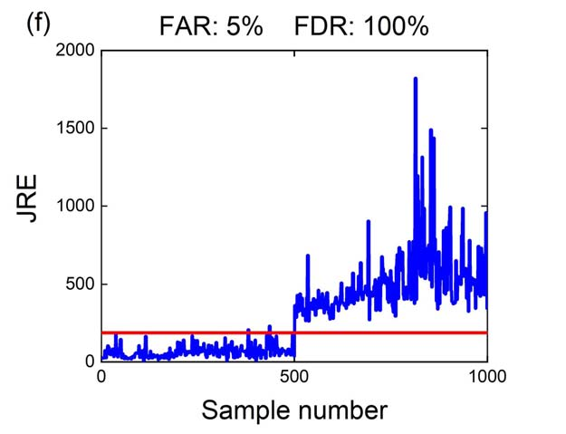

Fig. 2.

JSSDL-based process monitoring framework.

Solve for *D*1 column by column. When solving for the Unlike the traditional dictionary learning that uses a single *j*th atom, *d**j* is listed separately, and (12) can be rewritten dictionary to represent data, JSSDL uses a specific dictionary as follows:

and a shared dictionary to represent data and adds a sparsity constraint to the specific dictionary and a low-rank constraint   2 to the shared dictionary, which can deal with industrial data  *d**j*  *T* −*d**j**x* *j* *d**i**x**i* *Y*1− + 1*.* (13) with the complex feature.

*T* After establishing the optimization problem of JSSDL, *i*=*j* *F* we design an optimization method to solve it. Intuitively, Assuming that *E**j* =*Y*1− *i*=*j* *d**i**x**i* (9) can be solved via an alternate iterative optimization *T* is the residual matrix, method. However, since it involves a kernel norm of *D*2, the optimization problem can be described as follows:

it cannot be solved directly. Therefore, an auxiliary matrix *E**j* −*d**j**x* *j*  *d**j*  2 *P* is introduced in place of *D*2 in the low-rank constraint [26] *F* + min (14) *T* as follows:

1 *d**j* ⎧ ⎫ ∥*Y* −*D*1*X*1−*D*2*X*2∥2 *F* +*λ*1∥*X*1∥1 ⎨ ⎬ where*d**j* should be sparse, so most of the row vectors in*d**j**x* *j* +*λ*2∥*D*1∥1+*λ*3∥*X*2∥1+*λ*4∥*P*∥∗ ⎭*.* (10) min ⎩ *T* *D*1*,**D*2*,**X*1*,**X*2*,**P* are zero vectors. Let*d**j* = [*d**j*1*,**d**j*2*, . . . ,**d**jm*]*T* .*d**ji* denotes the +*λ*5∥*D*2−*P*∥2 *F* *i*th element of the column vector *d**j*, *i* ∈[1*,**m*]. Accordingly, Thus, we separate the kernel norm and the Frobenius norm *jm*]*T*. *e**ji* denotes the *i*th row vector in *E**j* = [*e**T* *j*1*,**e**T* *j*2*, . . . ,**e**T* of *D*2 and simplify the solving process. According to the *E**j*, *i* ∈[1*,**m*].

alternate iterative optimization, the variables can be optimized Set the sparsity of *d**j* as *a*, and solve each element of *d**j*.

one by one via fixing the others when optimizing one [22].

Let *L*1 = [∥*e**j*1∥1*, . . . ,*∥*e**ji*∥1*, . . . ,*∥*e**jm*∥1]. Here, we define a Accordingly, the proposed optimization algorithm includes sort function *f* = Sort*(**x**)*, where *x* is an element of matrix four parts: specific dictionary updating, auxiliary matrix updat- *X* and *f* is the sorting number of *x* in the order of *X* from ing, shared dictionary updating, and sparse coding matrices largest to smallest. When Sort*(*∥*e**ji*∥1*)*≤*a*, the corresponding updating. The detailed procedures are given as follows.

*d**ji* takes a nonzero value. The rest *d**ji* takes as 0.

*a)* *Update specific dictionary D*1*:* Fix unrelated variables, When *d**ji* takes a nonzero value, we need to calculate it.

and let *Y*1 = *Y* −*D*2*X*2. The optimization program can be The following equation is satisfied:

obtained as follows:

∥*Y*1−*D*1*X*1∥2  *F* +*λ*2∥*D*1∥1 *.* *D*1 =arg min (11) *e**ji* ≈*d**ji**x* *j* *T* *.* (15) *D*1 = [*d*1*, . . . ,**d**j**, . . . ,**d**k*].

*D*1 Let Correspondingly, *T**, . . . ,**x**k* *T*]*T*, *T**, . . . ,**x* *j* *⇀**e* between*d**ji**x* *j* *x* *j* *T* and*e**ji*.

Try to minimize the residual vector *X*1=[*x*1 where denotes the *T* *T* *T* *T* As the value of *d**ji* changes, the length of *d**ji**x* *j* *T* changes, row vector of the *j*th row in *X*1. Thus, (11) can be expressed *⇀**e* causing the magnitude and direction of the residual vector as follows:

 *Y*1− *⇀**e* is minimum when to change as well. According to Fig. 3, 2 *k* *k*   *⇀**e* is perpendicular to *x* *j* *T* . It is clear that *d**ji* at the direction of *d**i**x**i* ∥*d**i*∥1*.* + (12) *T* this situation is the most appropriate.

*i*=1 *i*=1 *F*

<!-- Page 5 -->

HUANG *et* *al.*: INDUSTRIAL PROCESS MODELING AND MONITORING BASED ON JSSDL 3500111 *d)* *Update* *sparse* *coding* *X*1 *and* *X*2*:* The objective

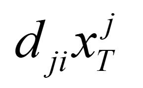

function turns to the following form when keeping the terms relevant only to *X*1 and *X*2:

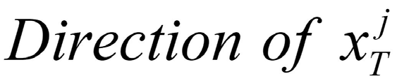

∥*Y* −*D*1*X*1−*D*2*X*2∥2  *F* {*X*1*,**X*2} =arg min *.* (22) +*λ*1∥*X*1∥1+*λ*3∥*X*2∥1 *X*1*,**X*2 There are two sparse coding matrices required to be solved, which cannot be solved directly by the OMP method, so *X*1 and *X*2 are solved by three steps as follows:

Geometric interpretation of *d**ji**x* *j* ∥*Y* −*D*2*X*2∥2  *T* and *e**ji*.

Fig. 3.

*F* +*λ*3∥*X*2∥1 *X*2 = arg min (23) *X*2 ∥*Y* −*D*2*X*2−*D*1*X*1∥2  *F* +*λ*1∥*X*1∥1 *X*1 = arg min (24) To summarize, use the following equation to solve for each *X*1 ∥*Y* −*D*1*X*1−*D*2*X*2∥2  element *d**ji* of *d**j*:

*F* +*λ*3∥*X*2∥1 *.* (25) *X*2 = arg min *X*2 ⎧ *e**ji*  *e**ji*·*x* *j* ⎨ *T* *,* if Sort*(* 1*)*≤*a* *x**j*  According to the assumptions, *Y* consists of characteristics 2 *d**ji* = (16) *T* ⎩ and commonalities. In (23), shared dictionary *D*2 is first used 2 0*,* otherwise*.* separately to reconstruct *Y* and calculate *X*2 because the *b)* *Update* *auxiliary* *matrix* *P:* Ignore irrelevant terms to commonalities are the main component of *Y*. Then, in (24), *P*; the objective function can be rewritten as follows:

the specific dictionary *D*1 is used to reconstruct characteristics *λ*4∥*P*∥∗+*λ*5∥*D*2−*P*∥2 *.* and calculate *X*1, where characteristics can be denoted as *P* =arg min (17) *Y* −*D*2*X*2. Likewise, in (25), commonalities can be denoted *F* *P* as*Y*−*D*1*X*1, and use *D*2 to reconstruct it. Through the above First, the soft threshold function is defined as follows:

three steps, the specific coding matrix and the shared coding matrix are solved separately to better extract the commonalities *S**τ**(σ)*=sign*(σ)*·max*(σ* −*τ,*0*)* (18) and characteristic features of the data. Apparently, (23)–(25) where *τ* denotes the soft threshold and *σ* denotes the input can be solved by the OMP method separately. First, precom- of the function. When the input of the soft threshold function pute *X*2 by (21), then calculate *X*1 by (22), and calculate *X*2 is a matrix, the solution is using the soft threshold function by (23).

for each element to obtain the corresponding matrix. Based In summary, according to the alternate iterative optimization on singular value decomposition, the update formula for *P* is method, the specific dictionary, i.e., the shared dictionary, can obtained as follows:

be obtained. In the optimization algorithm, we first solve for *D*1, *P*, *D*2, and, finally, sparse coding matrices. According to *D*2 = *SUV* *T* ; *P* = *S*·*S**τ**(**U**)*·*V* *T* *.* (19) the theory of the alternate iterative optimization method [27], different iteration sequences do not affect the final results, In (19), the diagonal matrix *U* and the two orthogonal all of which can cause the results to converge to the optimal matrices *S* and *V* are the results of the singular value solution. The above four parts are iterated sequentially until decomposition of *D*2, where on the main diagonal of *U* are convergence or stopping criteria are reached. The optimization the singular values in descending order. When the threshold problem of (9) includes four optimization variables: *D*1, *D*2, *τ* is chosen appropriately, *S**τ**(**U**)* can approximate *U* as *X*1, and *X*2. Although (9) is not joint convex to (*D*1, *D*2, much as possible to ensure the minimization of the regu- *X*1, and *X*2), it is convex with respect to each of them when lar term ∥*D*2−*P*∥2 *F*. With iterations, the smaller singular the others are fixed. Therefore, the convergence property of values in matrix *S**τ**(**U**)* gradually shrink to 0, and *S**τ**(**U**)* the proposed optimization method can be guaranteed, the becomes a low-rank matrix, ensuring the minimization of convergence of which has been studied in [25] and [28]. The the regular term ∥*P*∥∗, i.e., *P* gradually becomes a low-rank detailed steps about the optimization algorithm of JSSDL are matrix.

summarized in Algorithm 1.

*c)* *Update* *shared* *dictionary* *D*2*:* Ignore irrelevant terms *2)* *Online* *Process* *Monitoring:* After obtaining the dictio- to *D*2; the objective function regarding to *D*2 can be rewritten naries from the training data, the reconstruction errors of the as follows:

training data can be calculated as follows:

∥*Y* −*D*1*X*1−*D*2*X*2∥2 *.* *F* +*λ*5∥*D*2−*P*∥2 *D*2 =arg min *y**j* −*D*1*x*1*j* −*D*2*x*2*j* 2 *F* *D*2 *R**j* = (26) 2 (20) where *R**j* denotes the reconstruction error of the *j*th training Since the Frobenius norm is convex, we can obtain the data, and *x*1*j* and *x*2*j* denote the sparse coding of the *j*th closed-form solution of *D*2 directly by calculating the partial characteristic and commonality. After calculating the recon- derivative struction errors of training data, the threshold *R*tr can be    −1*.* *(**Y* −*D*1*X*1*)**X* *T* *X*2*X* *T* *D*2 = 2 +*λ*5*P* · 2 +*λ*5*E* (21) obtained by the kernel density estimation (KDE) method [29],

<!-- Page 6 -->

3500111 IEEE TRANSACTIONS ON INSTRUMENTATION AND MEASUREMENT, VOL. 71, 2022

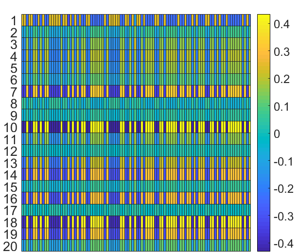

**Algorithm** **1** Jointly Specific and Shared Dictionary Learning

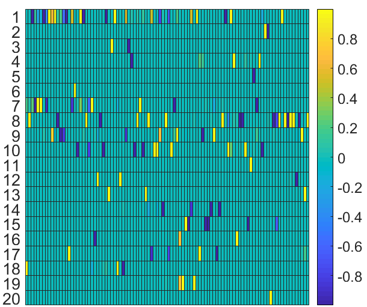

**Input**: Date *Y*, sizes of *D*1 and *D*2, the sparsity of *D*1, the sparsity of *X*1 and *X*2.

**Initialization:** *D*1, *D*2*,**X*1 and *X*2 randomly **While** *k* *<**iteration* **do** **Step** **1:** **Update** **specific** **dictionary.** Fix *D*2*(**k**)*, *X*1*(**k**)*, *X*2*(**k**)* and *P**(**k**)* to obtain *D*1*(**k*+1*)* according to Eq. (16);

**Step** **2:** **Update** **low-rank** **auxiliary** **matrix.** Fix *D*1*(**k* +1*)*, *D*2*(**k**)*, *X*1*(**k**)* (a) Heat map of *D*1. (b) Heat map of *D*2.

Fig. 4.

and *X*2*(**k**)* to obtain *P**(**k*+1*)* according to Eq. (19);

**Step** **3:** **Update** **shared** **dictionary.** Fix *D*1*(**k* +1*)*, *X*1*(**k**)*, *X*2*(**k**)* and III. ILLUSTRATIVEEXAMPLES *P**(**k*+1*)* to obtain *D*2*(**k*+1*)* according to Eq. (21);

In this section, three examples, including numerical simula- **Step** **4:** **Update** **sparse** **coding** **matrices.** Fix *D*1*(**k* + 1*)*, tion, TE process, and roasting process, are introduced to verify *D*2*(**k*+1*)* the effectiveness of the proposed method. In order to assess and *P**(**k* +1*)* to obtain *X*1*(**k* +1*)* and *X*2*(**k* +1*)* according the process monitoring performance quantitatively, FDR and to Eqs. (23)-(25);

FAR are defined as follows:

**Step** **5:** **Record** **the** **number** **of** **iterations.** *k* =*k*+1;

tp **end** **while** total count of faulty data ×100% FDR = (30) **Output**: Specific dictionary *D*1 and shared dictionary *D*2 fp total count of normal data ×100% FAR = (31) where tp and fp denote the number of correctly judged fault which is defined as follows:

samples and misjudged normal samples. In addition, to verify  *R*−*R**j*  the superiority of the proposed method, some state-of-the- *M*  1 *f**(**R**)*= *K* (27) art methods, including the PCA method [30], the robust *Mh* *h* PCA method [31], and the traditional dictionary learning *i*=1 method [25], are introduced for comparison.

where *M* denotes the number of training samples and *h* denotes the bandwidth. *f**(**R**)*is the density function, and *K**(**x**)* denotes the Gaussian kernel function. The probability density *A.* *Numerical* *Simulation* *Example* function of the reconstruction error is obtained according In order to verify the performance of the proposed method, to (27). Then, choose the appropriate confidence level *α* to we designed a numerical simulation experiment. Numerical calculate the Confidence interval of the reconstruction error.

data are generated as follows:

The upper limit of the confidence interval is the threshold *R*tr, which serves as a control limit for reconstruction error. When *y* =*k*1*y*1+*k*2*y*2+*e* (32) the reconstruction error of test data is greater than *R*tr, the data where *k**i* ∼*N**(*1*,*1*),* *i* = 1*,*2. *e* = [*e*1*, . . . ,**e**i**, . . . ,**e*20]*T* are faulty.

denotes the Gaussian noise, which satisfies *e**i* ∼*N**(*0*,*0*.*1*)*.

When online data arrive, we use the learned specific dic- According to the assumptions, we generated *y*1 and *y*2 as tionary and shared dictionary to reconstruct the newly arrived follows to ensure the sparse feature of characteristics and data. Mathematically, strongly correlated feature of commonalities:

*x*1*,**x*2∥*y*new−*D*1*x*1−*D*2*x*2∥2 {*x*new1*,**x*new2} = arg min 2 *y*1 =*k*1*i**a* +*k*2*i**b*;

*y*2 = *As* (33) s.t. ∥*x*1∥0 ≤*T*1*,* ∥*x*2∥0 ≤*T*2*.* (28) where*k**i* ∼*N**(*1*,*1*),* *i* =1*,*2.*i**a* and*i**b* are the column vectors After obtaining the sparse coding, the joint reconstruction in a unit matrix. *A* ∈*R*20×2 denotes the observation matrix of error (JRE) is calculated by the following equation:

commonalities. s = [*s*1*,**s*2]*T* is the state matrix and satisfies *s**i* ∼*N**(*1*,*0*.*5*),* *i* = 1*,*2. Hereafter, the generated data are JREnew = ∥*y*new−*D*1*x*new1−*D*2*x*new2∥2 2*.* (29) used to verify the validity of the proposed method.

First, to verify that the proposed optimization algorithm Intuitively, if the data sample is normal, it can be well can train a low-rank dictionary and a sparse dictionary, represented by the specific dictionary and shared dictionary;

we generated numerical data and trained *D*1*,**D*2 ∈*R*20×100.

thus, its JRE will be less than the threshold. If the data sample *D*1 and *D*2 are visualized in Fig. 4. In Fig. 4(a), there are is faulty, the JRE will be large than *R*trbecause the dictionaries only a few nonzero values in each column, which indicates cannot represent faulty data. Therefore, we determine the state that the optimization algorithm can train a sparse dictionary.

of the new data by comparing JREnew with the threshold *R*tr.

In Fig. 4(b), most of the columns are the same, indicating that If JREnew *>* *R*tr, the new test sample is considered as faulty the *D*2 is a low-rank matrix. Thus, we can conclude that the data. Otherwise, the data are considered normal.

<!-- Page 7 -->

HUANG *et* *al.*: INDUSTRIAL PROCESS MODELING AND MONITORING BASED ON JSSDL 3500111

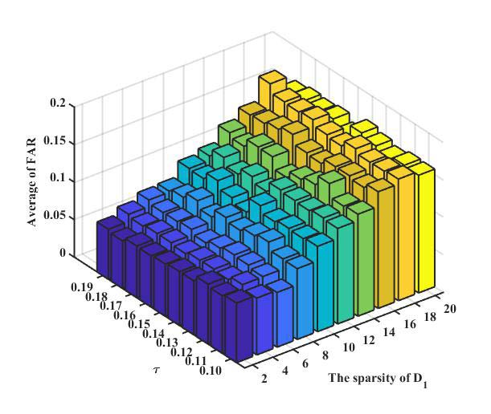

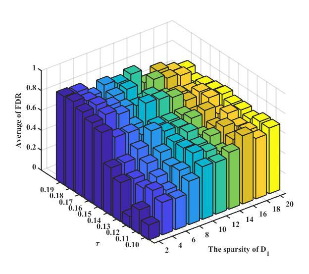

(a) Effect of the soft threshold on the rank of *D*2. (b) Effect of *τ* and the sparsity of *D*1 on FAR. (c) Effect of *τ* and the sparsity of *D*1 on FDR.

Fig. 5.

designed optimization algorithm. Then, the reconstruc-

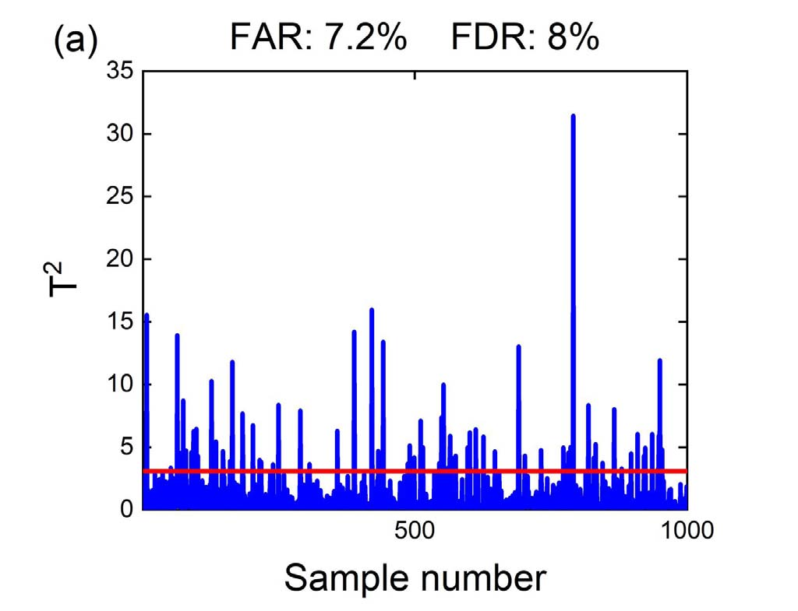

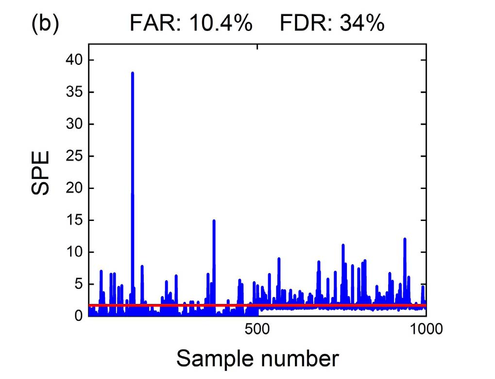

tion error of training data can be calculated. Finally, the threshold of reconstruction error can be calculated based on the KDE method.

3. *Online* *Decision-Making:* After obtaining the two dic-

tionaries, the sparse coding of the test data is obtained, and the reconstruction error of the test data is calculated.

By comparing the reconstruction error JRE with the

threshold *R*tr, we can obtain the state of test data.

Considering that the sparsity of *D*1 and the rank of *D*2 are two important parameters of the proposed JSSDL method, we conduct a parameter-sensitive analysis experiment to exam- ine their effects on FAR and FDR. We vary the sparsity of *D*1 directly from 2 to 20, with 2 per change. For the rank of *D*2, which cannot be adjusted directly in the optimization algorithm, we adjust it by changing the soft threshold *τ* and,

thus, further change the rank of *D*2. We change*τ* from 0.1 to

0. 19 without loss of generality. In this experiment, the number

of atoms of both *D*1 and *D*2 is 100, the sparsity of *X*1 is 2, the sparsity of *X*2 is 3, and the confidence level of the KDE is 0.92. A bias fault of +8 is added to *y*7 of the last 500 test data. To eliminate the fluctuation induced by the random initialization, we did several experiments and calcu- lated the mean of FAR and FDR to judge the effectiveness of process monitoring. Fig. 5 shows the results. In Fig. 5(a), Experiment results of the numerical example. (a) *T* 2 statistic of the Fig. 6.

the rank of *D*2 decreases with the increase in *τ*, which PCA method. (b) SPE statistic of the PCA method. (c) *T* 2 statistic of the verifies the effectiveness of using soft threshold iterations in robust PCA method. (d) SPE statistic of the robust PCA method. (e) DRE statistic of dictionary learning. (f) JRE statistic of the proposed method.

the optimization algorithm and illustrates the reasonableness of adjusting *τ* to change the rank of *D*2. In Fig. 5(b) and (c), we obtained the variation pattern of FAR and FDR. As the sparsity of *D*1 increases, the FAR keeps increasing, indicating optimization algorithm can ensure the sparsity and low-rank features of *D*1 and *D*2.

that process monitoring performance becomes worse. The After verifying the effectiveness of the optimization algo- change of the rank of *D*2 has no significant effect on the FAR. In Fig. 5(c), when *τ* is relatively large, and the sparsity rithm, the process monitoring procedure can be performed in three steps.

of *D*1 is small, the FDR is relatively large. This combination

1. *Data* *Generation:* Generate training data and test data

of parameters enables JSSDL to better learn the commonality by (32). For the training data, we generate 1000 normal and characteristic features of the data, and therefore, the FDR samples. For the test data, it consisted of two parts:

is significantly improved. This result indicates the combination 500 normal data and 500 faulty data. Faulty data are of the low-rank dictionary, and sparse dictionary is reasonable the normal data with a bias fault added in the seventh and can improve the process monitoring effect. In addition, the dimension *y*7.

best combination of parameters on the numerical simulation data that *τ* is 0.18, and the sparsity of *D*1 is 2 is obtained and

2. *Model* *Training:* Use the training data to learn the

used in the next experiment.

specific dictionary and shared dictionary based on the

<!-- Page 8 -->

3500111 IEEE TRANSACTIONS ON INSTRUMENTATION AND MEASUREMENT, VOL. 71, 2022

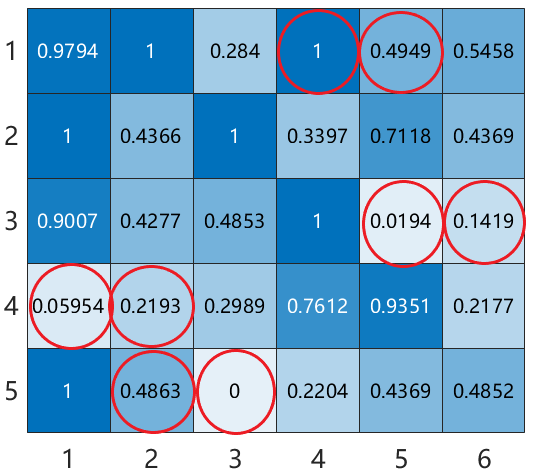

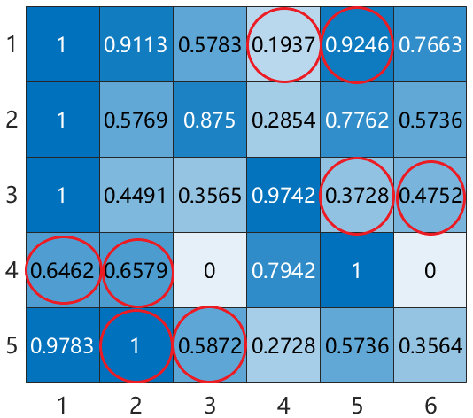

Fig. 7.

(a) Correlation coefficient matrix of 20 TE process samples. (b) Visualization of the first 30 dimensions of two normalized samples.

Next, we compare the process monitoring performance A total of 22 datasets are used in this experiment: the dataset of the proposed method with three state-of-the-art methods of the normal mode as the training set and the datasets of based on the numerical simulation data. The parameters of 21 fault modes as the test sets. All faults in the test datasets each method are set as follows. In PCA and robust PCA, were introduced after the 160th sample.

the CPV is 0.9. The regularization parameters of the robust First, to explain the characteristics and commonalities fea- PCA method are set according to its original settings: *λ* = ture of the TE process data, we performed a correlation analy- *(*1*/*√ max*(**m**,**M**))* and *μ* = 10*λ*. Therefore, *λ* = 0*.*0316 and sis. The correlation coefficient matrix of 20 training samples is *μ* = 0*.*316. For dictionary learning, the number of atoms shown in Fig. 7(a). It can be seen that the correlations between is 100, and the sparsity of the sparse coding is 3. For the most of the samples are not strong. To further investigate the proposed method, the number of atoms of both *D*1 and *D*2 underlying reason, we visualize the first 30 dimensions of is 100, the sparsity of *X*1 is 2, and the sparsity of *X*2 is 3.

two normalized samples in Fig. 7(b). When the difference in According to the previous experiment, the sparsity of *D*1 is 2, the same dimension at different moments is greater than 0.3, and *τ* is 0.18. The confidence level of KDE of all methods we consider it to be characteristic in this dimension and circle is 0.92 to ensure a fair comparison. A bias fault of +10 it. Apparently, there are eight dimensions with characteristics is added to *y*7 of the last 500 test data. Fig. 6 shows the in total, which causes a weak correlation between the data.

quantitative results of all methods. Since the data of numerical Since the data satisfy the assumptions that there are charac- simulation have obvious characteristics and commonalities teristics and commonalities in data, the proposed method can features, it is difficult for the PCA method and the robust PCA obtain a good performance.

method to monitor such data with complex features. Therefore, Next, we compare the monitoring effectiveness of different the *T* 2 and SPE statistics of PCA, as well as robust PCA, methods. The parameters of different methods are set fairly cannot obtain a satisfactory FDR. The dictionary learning is as follows. For the proposed method, the sparsities of both *X*1 and *X*2 are 5, and the sparsity of *D*1 is 5. The number of effective than the PCA and robust PCA method, However, due atoms for both *D*1 and *D*2 is 100.*τ* is 0.08. For the dictionary to its relatively poor representation of normal data, a larger learning method, the number of atoms is 100, and the sparsity FAR was created, and the FDR was affected to some extent.

is 3. For the PCA and robust PCA methods, the CPV is 0.9.

Among these four methods, the proposed method achieves the For the robust PCA method, *λ* = 0*.*0447, and *μ* = 0*.*447.

optimum performance.

The confidence level of all methods is 0.99. The FDR of 21 faults is shown in Table I. Apparently, the FDR of the *B.* *TE* *Process* *Example* proposed method is higher than other methods in the majority The TE benchmark process is a simulation of real industrial of faults. When faults 5, 16, 19, and 20 occur, it is difficult for processes created by Eastman Chemical Company and is the other methods to detect faulty data, but the proposed method most widely used model for evaluating process monitoring still has a relatively high FDR. The average value of FDR methods [32]–[35]. Due to the complex feature of the TE further verified the superiority of the proposed method. Due process, the data obtained in the TE process are consistent to space limitations, the vivid process monitoring results of with the assumptions of this article, and we chose it to validate the proposed method of faults 10, 13, 19, and 20 are shown the process monitoring performance of the proposed method.

in Fig. 8.

In the TE process, there are 41 measured variables (22 con- *C.* *Roasting* *Process* *Experiment* tinuous process variables and 19 composition variables) and 12 manipulated variables. A total of 21 faults were introduced To further verify the applicability of the proposed method, during the process. Similar to [36] and [37], 22 continuous an industrial roasting process of a zinc smelting factory in process variables and 11 manipulated variables were used in Hunan province, China, was introduced. Roasting is the first this experiment. Detailed data description is referenced to [38].

step in the zinc smelting process. The stable and safe operation

<!-- Page 9 -->

HUANG *et* *al.*: INDUSTRIAL PROCESS MODELING AND MONITORING BASED ON JSSDL 3500111

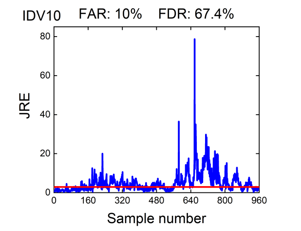

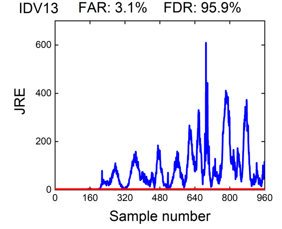

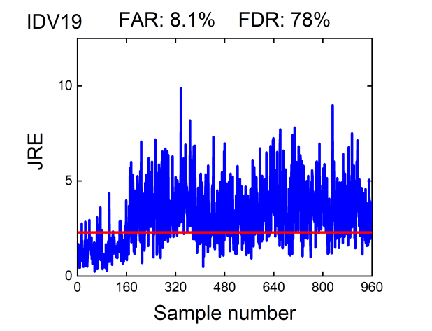

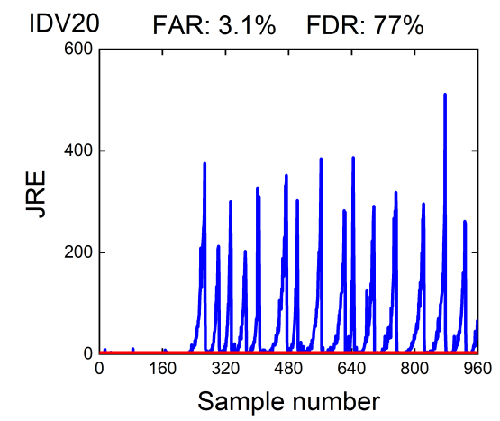

Fig. 9.

Structure of the roasting process.

Fig. 8.

Monitoring results of the proposed method for faults 10, 13, 19, and 20.

TABLE I

FDR OFTE PROCESS

Process monitoring results of the roasting process. (a) *T* 2 statistic Fig. 10.

of the PCA method. (b) SPE statistic of the PCA method. (c) *T* 2 statistic of the robust PCA method. (d) SPE statistic of the robust PCA method. (e) DRE statistic of dictionary learning. (f) JRE statistic of the proposed method.

SO2 concentration. The detailed physical significance of each dimension is given in Table II; 1000 normal samples were used as training data, and 500 normal samples and 500 samples for the faulty underoxidation condition were used as of the roasting process is highly important to reduce industrial test data.

pollution and ensure the quality of the output zinc. The We compare the monitoring effectiveness of different meth- main function of the roasting process is to oxidize the raw ods. For a fair comparison, the parameters of different methods ore at high temperature in the roaster so that the insoluble are set as follows. For the proposed method, the sparsities of *X*1 and *X*2 are 4 and 2, and the sparsity of *D*1 is 2. The zinc sulfide is converted into zinc oxide soluble in weak number of atoms for both *D*1 and *D*2 is 100. *τ* is 0.01. For acids, and the output material zinc roast is transported to the dictionary learning method, the number of atoms is 100, the subsequent leaching process. The structure of the roasting and the sparsity is 3. For the PCA and robust PCA method, process is shown in Fig. 9. It makes sense to perform process the CPV is 0.9. For the robust PCA method, *λ* = 0*.*0316 monitoring for the roasting process to ensure a stable and safe and *μ* = 0*.*316. The confidence level of all methods is 0.99.

operation.

Fig. 10 shows the experiment results. It can be seen that In the roasting process, a total of 25 dimensions of vari- the faulty working condition can be well detected by various ables were measured, including the temperature measure- methods. However, since the proposed method can extract ments in the roaster, the feed volume, blowing pressure the characteristics feature perfectly, its FAR is better than and rate, outlet flue gas pressure and temperature, and the

<!-- Page 10 -->

3500111 IEEE TRANSACTIONS ON INSTRUMENTATION AND MEASUREMENT, VOL. 71, 2022 TABLE II MONITORINGVARIABLES OF THEROASTINGPROCESS other methods, which further indicates the effectiveness of the [4] Z. Guo, Y. Wan, and H. Ye, “An unsupervised fault-detection method for railway turnouts,” *IEEE* *Trans.* *Instrum.* *Meas.*, vol. 69, no. 11, proposed method.

pp. 8881–8901, Nov. 2020.

[5] K. Huang, H. Wen, C. Zhou, C. Yang, and W. Gui, “Transfer dictio- IV. CONCLUSION AND DISCUSSION nary learning method for cross-domain multimode process monitoring and fault isolation,” *IEEE* *Trans.* *Instrum.* *Meas.*, vol. 69, no. 11, Considering that raw data of industrial processes are always pp. 8713–8724, Nov. 2020.

featured by characteristics and commonalities, which raises [6] X. Ma, Y. Si, Z. Yuan, Y. Qin, and Y. Wang, “Multistep dynamic slow feature analysis for industrial process monitoring,” *IEEE Trans. Instrum.* difficulties in process monitoring, this article proposes a *Meas.*, vol. 69, no. 12, pp. 9535–9548, Dec. 2020.

JSSDL method to obtain an accurate process monitoring [7] K. Huang, S. Wu, F. Li, C. Yang, and W. Gui, “Fault diagnosis performance. First, we build the specific dictionary and shared of hydraulic systems based on deep learning model with multirate dictionary to extract the characteristics and commonalities data samples,” *IEEE* *Trans.* *Neural* *Netw.* *Learn.* *Syst.*, early access, Jun. 10, 2021, doi: 10.1109/TNNLS.2021.3083401.

feature of raw data. Then, the control limit for process [8] L. Feng and C. Zhao, “Fault description based attribute transfer for zero- monitoring is obtained from the training data by using the sample industrial fault diagnosis,” *IEEE* *Trans.* *Ind.* *Informat.*, vol. 17, KDE method. When new data arrive, the data are recon- no. 3, pp. 1852–1862, Mar. 2021.

structed by the two dictionaries, and the JRE is compared [9] S. Zhang and C. Zhao, “Slow-feature-analysis-based batch process monitoring with comprehensive interpretation of operation condition with the control limit for process monitoring. To illustrate the deviation and dynamic anomaly,” *IEEE* *Trans.* *Ind.* *Electron.*, vol. 66, effectiveness of the method, extensive experiments, including no. 5, pp. 3773–3783, May 2019.

numerical simulation experiments, TE process experiments, [10] Q. Jiang, X. Yan, and B. Huang, “Performance-driven distributed and an industrial roasting process experiment, are conducted.

PCA process monitoring based on fault-relevant variable selection and Bayesian inference,” *IEEE* *Trans.* *Ind.* *Electron.*, vol. 63, no. 1, Compared with some state-of-the-art methods, the proposed pp. 377–386, Jan. 2016.

method can learn the feature of the data better, have better data [11] Q. Jiang *et* *al.*, “Neural network aided approximation and parameter representation capability, and, thus, further achieve satisfactory inference of non-Markovian models of gene expression,” *Nature* *Com-* process monitoring results. The proposed method is applicable *mun.*, vol. 12, no. 1, pp. 1–12, Dec. 2021.

[12] Y. Si, Y. Wang, and D. Zhou, “Key-performance-indicator-related to complex industrial process monitoring, but we have only process monitoring based on improved kernel partial least squares,” studied process monitoring in a single mode at present. It is *IEEE* *Trans.* *Ind.* *Electron.*, vol. 68, no. 3, pp. 2626–2636, Mar. 2021.

an interesting future research direction to extend the method [13] Z. Chen *et* *al.*, “A just-in-time-learning-aided canonical correlation to multimode process monitoring. In addition, since the data analysis method for multimode process monitoring and fault detection,” *IEEE* *Trans.* *Ind.* *Electron.*, vol. 68, no. 6, pp. 5259–5270, Jun. 2021.

of different modes may have different commonalities and [14] Y. Dong and S. J. Qin, “A novel dynamic PCA algorithm for dynamic characteristic features, if these discriminative features can be data modeling and process monitoring,” *J.* *Process* *Control*, vol. 67, extracted, it will be very helpful for the mode identifica- pp. 1–11, Jul. 2018.

tion of process data, which also will be investigated in our [15] Q. Jiang, S. Yan, H. Cheng, and X. Yan, “Local-global modeling and distributed computing framework for nonlinear plant-wide process future work.

monitoring with industrial big data,” *IEEE* *Trans.* *Neural* *Netw.* *Learn.* *Syst.*, vol. 32, no. 8, pp. 3355–3365, Aug. 2021.

REFERENCES [16] M. Elad, M. A. T. Figueiredo, and Y. Ma, “On the role of sparse and redundant representations in image processing,” *Proc.* *IEEE*, vol. 98, [1] G. Mois, T. Sanislav, and S. C. Folea, “A cyber-physical system for no. 6, pp. 972–982, Jun. 2010.

environmental monitoring,” *IEEE* *Trans.* *Instrum.* *Meas.*, vol. 65, no. 6, [17] Z. Jiang, Z. Lin, and L. S. Davis, “Label consistent K-SVD: Learning pp. 1463–1471, Jun. 2016.

a discriminative dictionary for recognition,” *IEEE* *Trans.* *Pattern* *Anal.* [2] Z. Asad, M. A. R. Chaudhry, and D. Kundur, “On the use of Matroid *Mach.* *Intell.*, vol. 35, no. 11, pp. 2651–2664, Nov. 2013.

theory for distributed cyber–physical-constrained generator scheduling [18] J. Mairal, F. Bach, J. Ponce, G. Sapiro, and A. Zisserman, “Supervised in smart grid,” *IEEE* *Trans.* *Ind.* *Electron.*, vol. 62, no. 1, pp. 299–309, dictionary learning,” 2008, *arXiv:0809.3083*.

Jan. 2015.

[3] Y. Li, E. Zio, N. Lu, X. Wang, and B. Jiang, “Joint distribution-based [19] Q. Zhang and B. Li, “Discriminative K-SVD for dictionary learning in face recognition,” in *Proc.* *23rd* *IEEE* *Comput.* *Vis.* *Pattern* *Recognit.*, test selection for fault detection and isolation under multiple faults condition,” *IEEE* *Trans.* *Instrum.* *Meas.*, vol. 70, pp. 1–13, 2021.

San Francisco, CA, USA, Jun. 2010, pp. 13–18.

<!-- Page 11 -->

HUANG *et* *al.*: INDUSTRIAL PROCESS MODELING AND MONITORING BASED ON JSSDL 3500111 **Keke** **Huang** (Member, IEEE) received the B.A.

[20] L. Ren and W. Lv, “Fault detection via sparse representation for semi-

conductor manufacturing processes,” *IEEE* *Trans.* *Semicond.* *Manuf.*, degree in automatic control from Northeastern Uni- vol. 27, no. 2, pp. 252–259, May 2014.

versity, Shenyang, China, in 2012, and the Ph.D.

degree in control science and engineering from [21] K. Huang, Y. Wu, C. Yang, G. Peng, and W. Shen, “Structure dictionary Tsinghua University, Beijing, China, in 2017.

learning-based multimode process monitoring and its application to He is currently an Associate Professor with Central aluminum electrolysis process,” *IEEE* *Trans.* *Autom.* *Sci.* *Eng.*, vol. 17, South University, Changsha, China. His research no. 4, pp. 1989–2003, Oct. 2020.

interests include network sciences, industrial big [22] K. Huang, Y. Wu, C. Wang, Y. Xie, C. Yang, and W. Gui, “A projective data, and process monitoring.

and discriminative dictionary learning for high-dimensional process monitoring with industrial applications,” *IEEE* *Trans.* *Ind.* *Informat.*, vol. 17, no. 1, pp. 558–568, Jan. 2021.

[23] C. Yang *et* *al.*, “Multimode process monitoring based on robust dic- **Zui** **Tao** received the B.A. degree in automation

tionary learning with application to aluminium electrolysis process,” from Central South University, Changsha, China, *Neurocomputing*, vol. 332, pp. 305–319, Mar. 2019.

in 2021, where he is currently pursuing the M.A.

[24] S. K. Sahoo and A. Makur, “Signal recovery from random measurements degree in control science and engineering.

via extended orthogonal matching pursuit,”*IEEE Trans. Signal Process.*, His research interests include dictionary learning vol. 63, no. 10, pp. 2572–2581, May 2015.

and process monitoring.

[25] M. Aharon, M. Elad, and A. Bruckstein, “K-SVD: An algorithm for designing overcomplete dictionaries for sparse representation,” *IEEE* *Trans.* *Signal* *Process.*, vol. 54, no. 11, pp. 4311–4322, Nov. 2006.

[26] Y.-Q. Zhao and J. Yang, “Hyperspectral image denoising via sparse representation and low-rank constraint,” *IEEE* *Trans.* *Geosci.* *Remote* *Sens.*, vol. 53, no. 1, pp. 296–308, Jan. 2015.

**Bei** **Sun** received the Ph.D. degree in control sci-

[27] C. Hu, G. Wang, K. C. Ho, and J. Liang, “Robust ellipse fitting with ence and engineering from Central South University, Laplacian kernel based maximum correntropy criterion,” *IEEE* *Trans.* Changsha, China, in 2015.

*Image* *Process.*, vol. 30, pp. 3127–3141, 2021.

From 2012 to 2014, he was with the Department [28] J. Mairal, F. Bach, J. Ponce, and G. Sapiro, “Online dictionary learning of Electrical and Computer Engineering, Polytech- for sparse coding,” in*Proc. Int. Conf. Mach. Learn.*, 2009, pp. 689–696.

nic School of Engineering, New York University, [29] S. J. Sheather and M. C. Jones, “A reliable data-based bandwidth New York City, NY, USA. He is currently an selection method for kernel density estimation,” *J.* *Roy.* *Statist.* *Soc.* Associate Professor with Central South University.

*B,* *Methodol.*, vol. 53, no. 3, pp. 683–690, 1991.

His research interests include data-driven modeling, optimization, and control of nonferrous metallurgical [30] M. Kano, S. Hasebe, I. Hashimoto, and H. Ohno, “A new multivariate processes.

statistical process monitoring method using principal component analy- sis,”*Comput. Chem. Eng.*, vol. 25, nos. 7–8, pp. 1103–1113, Aug. 2001.

[31] E. J. Candès and X. Li, “Robust principal component analysis?”*J. ACM*, **Chunhua Yang**(Senior Member, IEEE) received the

vol. 58, no. 3, pp. 1–37, 2011.

M.S. degree in automatic control engineering and [32] A. Raich and A. Cinar, “Multivariate statistical methods for monitoring the Ph.D. degree in control science and engineering continuous processes: Assessment of discrimination power of distur- from Central South University, Changsha, China, in bance models and diagnosis of multiple disturbances,” *Chemometrics* 1988 and 2002, respectively.

*Intell.* *Lab.* *Syst.*, vol. 30, no. 1, pp. 37–48, 1995.

Since 1999, she has been a Full Professor with [33] A. Singhal and D. E. Seborg, “Evaluation of a pattern matching method the School of Information Science and Engineering, for the Tennessee eastman challenge process,” *J.* *Process* *Control*, Central South University. She is currently the Head vol. 16, no. 6, pp. 601–613, Jul. 2006.

of Department (HoD) of the School of Automation.

Her current research interests include modeling and [34] L. H. Chiang, E. L. Russell, and R. D. Braatz, *Fault* *Detection* *and* optimal control of complex industrial processes, and *Diagnosis* *in* *Industrial* *Systems*. London, U.K.: Springer, 2001.

intelligent control systems.

[35] Z. Ge and Z. Song, “Process monitoring based on independent compo- nent analysis–principal component analysis (ICA–PCA) and similarity factors,”*Ind. Eng. Chem. Res.*, vol. 46, no. 7, pp. 2054–2063, Mar. 2007.

**Weihua** **Gui** received the B.Eng. degree in electri-

[36] G. Chen and Z. Ge, “Hierarchical Bayesian network modeling frame- cal engineering and the M.S. degree in automatic work for large-scale process monitoring and decision making,” *IEEE* control engineering from Central South University, *Trans.* *Control* *Syst.* *Technol.*, vol. 28, no. 2, pp. 671–679, Mar. 2020.

Changsha, China, in 1976 and 1981, respectively.

Since 2013, he has been an Academician of the [37] S. Yin, S. X. Ding, A. Haghani, H. Hao, and P. Zhang, “A comparison Chinese Academy of Engineering, Beijing, China.

study of basic data-driven fault diagnosis and process monitoring meth- He is currently with the School of Automation, Cen- ods on the benchmark Tennessee Eastman process,” *J.* *Process* *Control*, tral South University. His current research interests vol. 22, no. 9, pp. 1567–1581, 2012.

include modeling and optimal control of complex [38] A. Bathelt, N. L. Ricker, and M. Jelali, “Revision of the Tennessee industrial processes, fault diagnoses, and distributed *IFAC-PapersOnLine*, Eastman process model,” vol.

48, no.

8, robust control.

pp. 309–314, 2015.
