JSSDL 工业过程监测论文复现汇报文档

基于 Industrial Process Modeling and Monitoring Based on Jointly Specific and Shared Dictionary Learning

__报告对象__

论文复现工作阶段汇报

__代码仓库__

JSSDL\-Reproduction

__主要数据__

数值模拟数据；TEP 数据集可视化；PCA/RPCA/DL/JSSDL 实验结果

__报告重点__

论文背景、模型原理、参数与敏感性、复现实验结果、问题与总结

本报告先服务于论文复现汇报文档，后续可直接拆分为 PPT 章节。

# 1\. 论文背景与问题定义

工业网络物理系统使工业过程中的传感器、执行器和控制系统持续产生大规模运行数据。在生产过程中，设备负荷、物料状态、控制目标和外部环境会随工况发生转换；如果监测模型只把所有正常样本看作单一稳定分布，就容易把正常工况切换中的局部变化误判为故障。

原论文的核心观察是：工业过程数据同时包含“共性”和“特性”。共性是不同样本之间反复出现、相关性强的公共结构；特性则来自工况切换或局部扰动，通常只作用于少数变量，因此具有稀疏性。过程监测的难点在于，特性不是简单噪声，它既可能是正常工况中的局部差异，也可能与故障扰动形态接近。

## 1\.1 TEP 数据中的共性与特性可视化

当前项目中已经存在能够说明这一现象的 TEP 可视化。相关性热力图显示多个变量之间存在稳定相关块，这对应论文中“commonalities are strongly correlated”的假设；标准化热力图和高波动变量的时间变化显示，部分变量在局部区间出现更明显的幅值变化，这对应“characteristics are sparse”的假设。

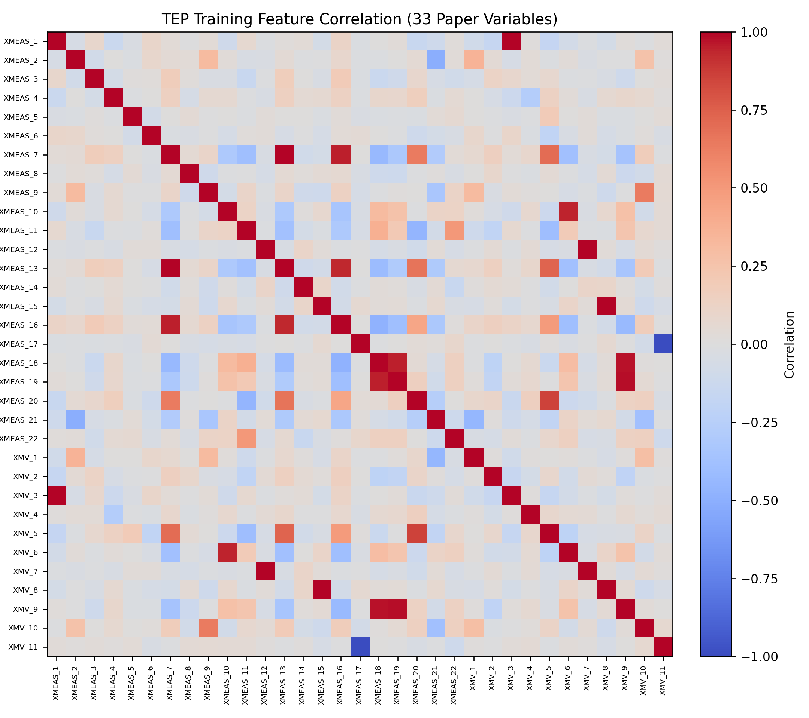

*图 1：TEP 训练数据相关性热力图。相关块说明过程变量之间存在可共享的公共结构。*

__图像解读：__这张图的横纵轴都是 TEP 变量，颜色表示两两相关程度。可以看到并不是所有变量都彼此独立，而是存在若干偏红或偏蓝的局部块，例如某些测量变量与阀门变量之间呈现稳定正相关或负相关。这说明工业过程内部受同一物理机理和控制回路约束，多个变量会一起变化。因此，这张图适合用来说明论文中的“共性”：数据中存在跨样本、跨变量共享的低维相关结构，JSSDL 中的共享字典 D2 正是为了学习这种公共结构。

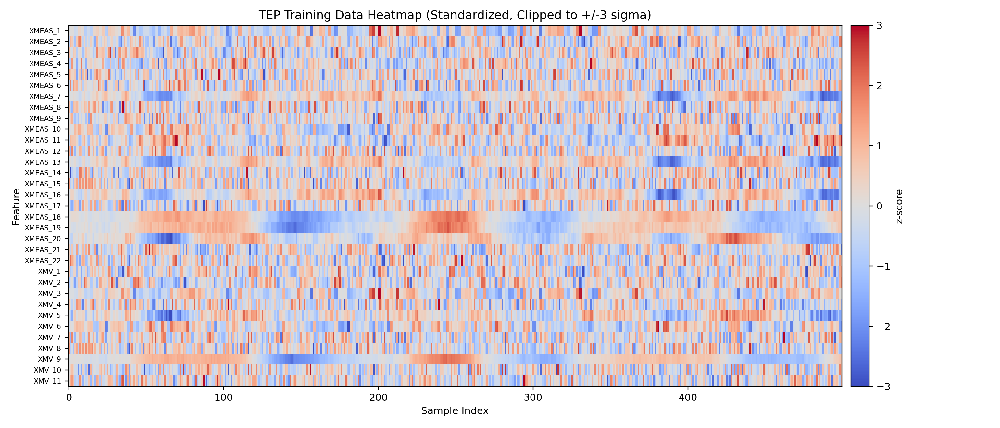

*图 2：TEP 标准化训练数据热力图。局部变量随样本段出现差异，可作为特性成分的可视化证据。*

__图像解读：__这张图把每个变量标准化后按样本顺序展开，颜色表示 z\-score。多数变量呈现细碎、幅度相对均匀的波动，但有少数变量在某些时间段出现连续偏红或偏蓝的条带，说明变化集中在部分维度和部分样本段上。这种现象不是全局所有变量同步变化，而是局部变量的局部偏移，符合“特性成分稀疏出现”的描述。所以它可以作为 TEP 数据中工况差异或局部特征存在的可视化证据。

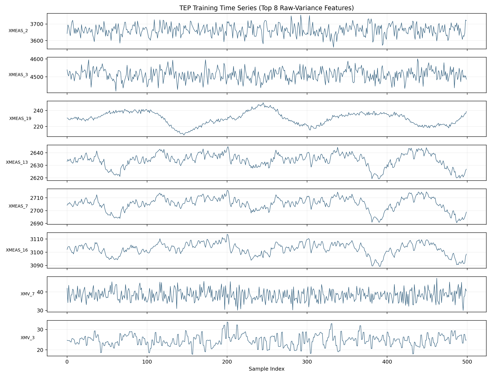

*图 3：TEP 高方差变量时间序列。少数变量承担了更强的局部变化，适合用于引出特性稀疏性。*

__图像解读：__图 2 从全局热力图角度说明局部条带，而图 3 进一步把波动最大的变量单独拿出来观察。如果所有变量都只包含同一种公共变化，那么高方差变量之间应表现为非常相似的走势；但这里不同变量的峰值位置、变化强度和持续区间并不完全一致，说明某些变量携带了更明显的局部差异。这些局部差异如果被传统模型当作异常，就会造成误报；如果被完全剔除，又会丢失正常工况中的特性信息。

# 2\. 基线模型及其不足

## 2\.1 PCA：单一低维主子空间假设

PCA 将正常数据投影到由主成分张成的低维线性空间中，并用 T2 统计量衡量主空间内的异常波动，用 SPE 统计量衡量残差空间中的未解释变化。它的优势是结构简单、解释性强，但隐含了一个较强假设：正常样本的主要变化可以由一个全局低维子空间描述。

在存在工况转换的工业场景中，正常样本中的稀疏特性可能落入残差空间，从而被误认为故障；反过来，如果为了降低 FAR 而放宽阈值，又会削弱真实故障的检测能力。

## 2\.2 RPCA：剔除稀疏项后的改进与局限

RPCA 将数据分解为低秩部分 L 和稀疏部分 S，可写作 X = L \+ S。它的直觉是把少数维度上的异常或离群变化放入 S，再用更干净的 L 建立 PCA 模型。因此，与 PCA 相比，RPCA 可以减少稀疏扰动对主子空间的污染。

但是，RPCA 的问题也来自这一步“剔除”：如果正常数据中的特性本来具有业务含义，直接把它当作稀疏离群项去掉，会导致模型学不到正常特性；在线监测时，如果不剔除稀疏项，正常特性容易引发误报；如果继续剔除，又可能把真实故障当作特性抹掉。

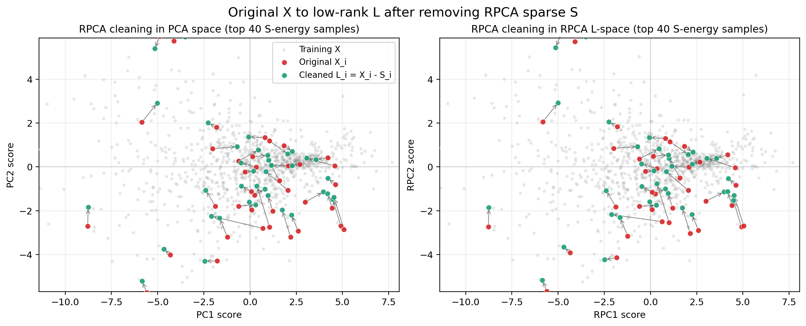

*图 4：RPCA 从原始 X 中剔除稀疏 S 后得到低秩 L。箭头展示了训练样本向低秩空间收缩的过程。*

__图像解读：__红点表示原始样本 X，绿点表示剔除稀疏项 S 后得到的低秩样本 L，箭头表示清理方向。可以看到，RPCA 会把一些偏离主云团的样本拉回更集中的低秩空间，这解释了为什么 RPCA 相比 PCA 有改善：它降低了稀疏扰动对主子空间建模的污染。但这也暴露出局限：箭头所剔除的部分并不一定全是无意义噪声，在工业工况切换中，它可能正是正常样本的特性。因此，RPCA 是“去掉特性后再建模”，而不是“学习特性并利用特性”。

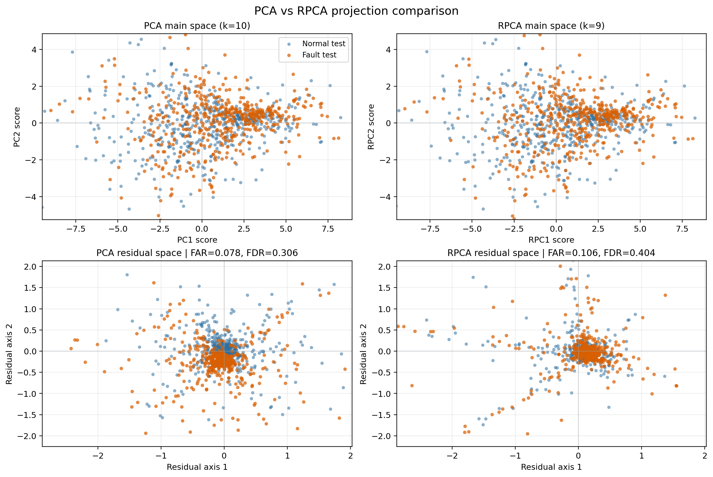

*图 5：PCA 与 RPCA 投影空间对比。RPCA 的残差空间更集中，代表稀疏扰动被部分清理，但故障与正常仍有重叠。*

__图像解读：__上排展示主空间投影，下排展示残差空间。RPCA 的残差点云比 PCA 更紧凑，说明稀疏项清理确实让数据结构更规整；对应的单次 FDR 也从 PCA 残差空间的 0\.306 提升到 RPCA 的 0\.404。但是橙色故障点和蓝色正常点仍然大量混在一起，说明 RPCA 只是缓解了特性干扰，并没有真正建立“共性/特性”双结构模型。这正是引出 JSSDL 的关键：工业数据中的稀疏特性不应该只被删除，而应该被一个专门的特性字典显式表达。

__方法__

__平均 FAR__

__平均 FDR__

__复现解读__

JSSDL \(ridge\_X1=0\.05\)

10\.5%

89\.2%

最终汇报版本，抑制 X1 异常大系数后检出率明显提升

PCA

10\.3%

33\.2%

低误报但对局部偏置故障不敏感

Robust PCA

13\.0%

48\.7%

剔除稀疏项后仍不能学习正常特性

DL

16\.8%

58\.2%

重构能力强但正常段尖峰较多

*表 1：结合已有 PPT 后采用的 20 次数值模拟平均监测指标。*

数据来源：D:\\桌面\\论文复现\.pptx 中 ridge\_X1=0\.05 汇报版本结果。

表 1 可以作为基线不足的定量总结。PCA 的平均 FAR 为 10\.3%，看起来误报控制较好，但平均 FDR 只有 33\.2%，说明大量故障没有被识别。RPCA 的平均 FDR 为 48\.7%，证明低秩\-稀疏分解确实能减少部分稀疏扰动带来的影响；但 FAR 同时升至 13\.0%，说明它在清理稀疏特性后仍然无法稳定区分正常特性与故障偏移。DL 的 FDR 高于 PCA/RPCA，但 FAR 也最高，因为单字典重构没有约束哪些原子负责稀疏局部变化、哪些原子负责共享低秩结构。加入 ridge\_X1 后，JSSDL 的平均 FDR 达到 89\.2%，平均 FAR 为 10\.5%，说明双字典结构叠加编码正则后，既能显著提升故障检出，又能把误报控制在与 PCA 接近的水平。

# 3\. JSSDL 模型原理与复现实现

JSSDL 的关键思想不是把特性从数据里删除，而是分别用特性字典 D1 和共享字典 D2 对它们进行表达。这样，正常样本中的稀疏特性可以被 D1 吸收，公共相关结构可以被 D2 表示，最终通过联合重构误差 JRE 判断样本是否异常。

Y = Y1 \+ Y2

Y ≈ D1 X1 \+ D2 X2

min ||Y \- D1 X1 \- D2 X2||\_F^2 \+ λ1||X1||\_1 \+ λ2||D1||\_1 \+ λ3||X2||\_1 \+ λ4||D2||\_\*

with auxiliary P: min \.\.\. \+ λ4||P||\_\* \+ λ5||D2 \- P||\_F^2

## 3\.1 D1 如何保证稀疏特性

D1 面向特性成分 Y1。论文中对 D1 加入 L1 稀疏约束，复现代码进一步采用按原子列更新的支持集规则：对每个原子计算残差行的重要性，只保留得分最高的 a 个特征维度，其余元素置零。因此，每个 D1 原子只负责少数变量上的局部变化。

## 3\.2 D2 与 P 如何保证低秩共性

D2 面向共性成分 Y2。强相关的共性可以由低秩结构表达，因此论文使用核范数近似 rank\(D2\)。为了便于交替优化，引入辅助矩阵 P，并对 D2 的奇异值做软阈值收缩：若 D2 = UΣV^T，则 P = U Sτ\(Σ\) V^T。较小奇异值在迭代中逐渐被压到 0，P 逼近低秩矩阵，再通过 ||D2 \- P||\_F^2 项牵引 D2 保持低秩结构。

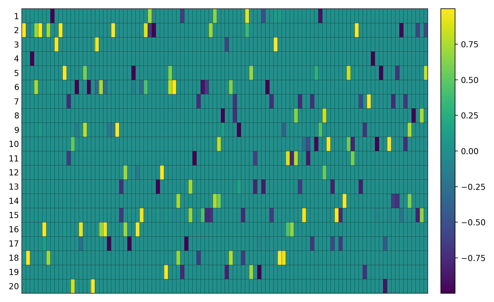

*图 6：复现得到的特性字典 D1。每列仅少数位置非零，体现稀疏原子结构。*

__图像解读：__D1 热力图中，纵轴为变量维度，横轴为字典原子。大多数位置接近背景色，只有少量明亮或深色竖向点出现。这说明每个 D1 原子只在少数变量上有显著权重。它与数值模拟中的 y1 生成方式一致：每个样本的特性成分只激活少数维度。因此，D1 不会像普通字典那样用密集原子解释所有变量，而是把表达能力集中在局部稀疏变化上，这就是 JSSDL 能吸收正常工况局部差异、降低误把特性当故障的风险的原因。

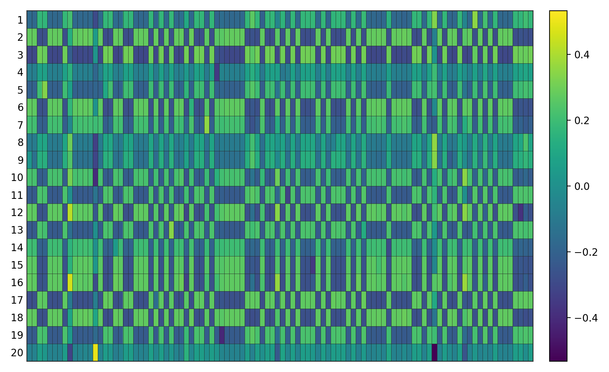

*图 7：复现得到的共享字典 D2。列模式呈现相似结构，说明公共信息被压缩到低秩子空间。*

__图像解读：__D2 热力图与 D1 明显不同：D2 的很多列呈现相似的条纹模式，而不是零散分布的单点。这意味着多个字典原子并非独立学习完全不同的局部变量，而是在重复表达少数共享方向。从矩阵角度看，列之间越相似，矩阵有效秩越低；从工业过程角度看，这对应多个传感器由同一潜在状态或控制关系驱动。所以 D2 适合解释数据中的“共性”，即强相关、可共享、低维的公共过程结构。

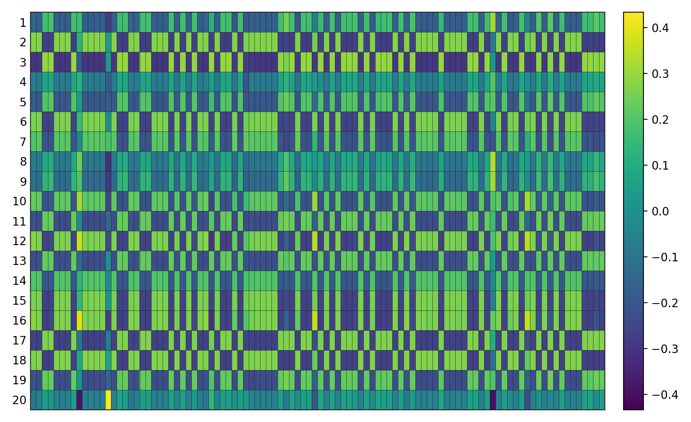

*图 8：辅助矩阵 P 的热力图。P 承担核范数低秩约束的近端更新角色。*

__图像解读：__P 的形态与 D2 接近，但它不是直接用于最终重构的普通字典，而是在优化中承接核范数惩罚。论文引入 P 的原因是 D2 同时出现在重构误差和核范数中，直接优化比较困难；把低秩约束放到 P 上，再用 ||D2\-P||\_F^2 迫使 D2 靠近 P，可以把问题拆成更容易求解的子问题。因此，这张图要和 D2 热力图一起看：P 保持低秩模板，D2 在重构能力和低秩结构之间折中。

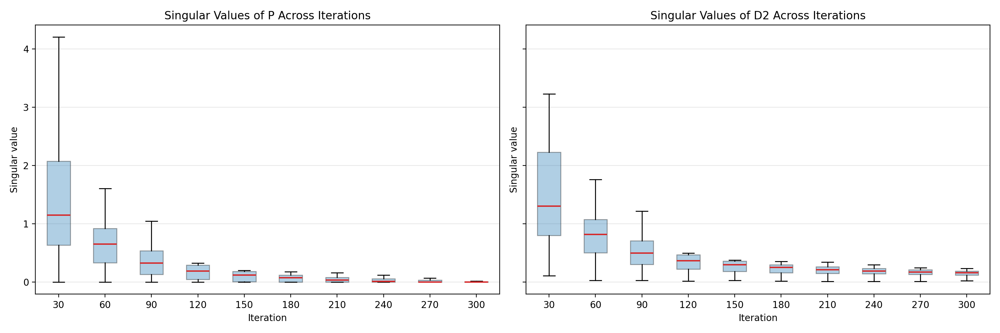

*图 9：P 与 D2 的奇异值随迭代下降。P 的尾部奇异值更快收缩，D2 被低秩辅助矩阵牵引。*

__图像解读：__奇异值可以理解为矩阵中不同独立方向的重要性。左图中 P 的奇异值随着迭代快速下降，后期许多奇异值接近 0，说明软阈值操作确实在压缩矩阵秩。右图中 D2 的奇异值下降更平缓，这是因为 D2 还要承担重构数据的任务，不能被直接压成过低秩。两者合起来说明：JSSDL 不是简单强制 D2 低秩，而是通过 P 对 D2 施加柔性的低秩牵引，让共享字典既能表达公共结构，又保留必要的重构能力。

## 3\.3 交替优化与局部最优

JSSDL 的目标函数对 D1、D2、X1、X2、P 不是联合凸的，因此不能保证得到全局最优解。论文与本项目都采用局部交替优化：固定其它变量，依次更新 D1、P、D2、X1/X2。每个子问题相对容易求解，但最终结果依赖初始化、参数和迭代停止条件，因而报告中应称为“收敛到局部最优或稳定解”。

Update D1: keep row support with size a and solve each atom by residual projection

Update P: singular value soft\-thresholding, Sτ\(σ\)=sign\(σ\)·max\(|σ|\-τ,0\)

Update D2: D2 = \(\(Y\-D1X1\)X2^T \+ λ5P\)\(X2X2^T \+ λ5I\)^\(\-1\)

Update X1, X2: three\-step OMP coding

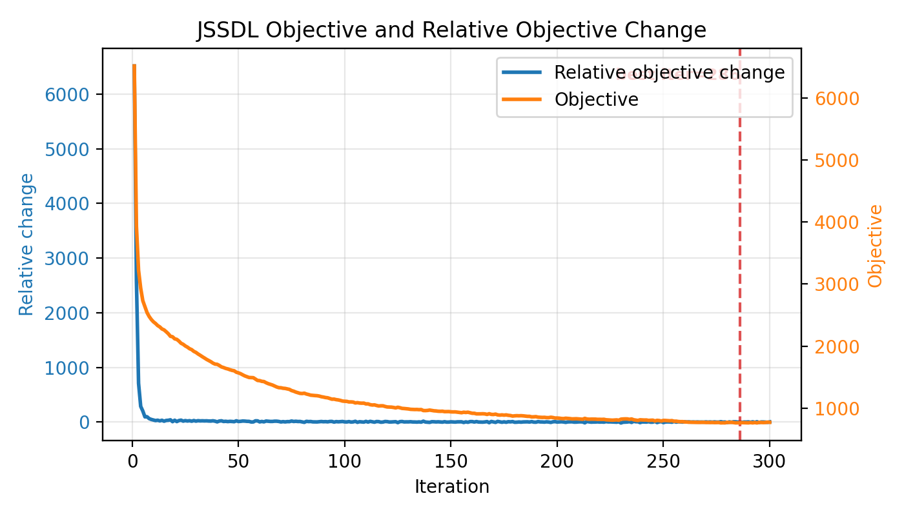

*图 10：JSSDL 目标函数与相对变化。目标值持续下降，说明交替优化过程趋于稳定。*

__图像解读：__橙色曲线是目标函数值，蓝色曲线表示相邻迭代之间的变化。前期下降很快，说明随机初始化后的字典和编码迅速调整到较合理的区域；后期曲线变平，说明继续迭代只能带来较小改进。这张图不能证明全局最优，因为 JSSDL 的联合目标函数不是联合凸的；但它可以证明本次复现的交替优化没有发散，而是收敛到一个稳定的局部解。汇报时应强调“局部最优/稳定解”，而不是“全局最优”。

## 3\.4 参数配置与敏感性分析

__参数__

__复现取值__

__作用__

n\_features

20

数值模拟变量维度

random\_state / n\_runs

9 / 20

PPT 汇报版采用 20 次重复实验统计平均指标

shared\_rank

2

共性成分真实生成秩

n\_train / n\_test

1000 / 1000

训练正常样本；测试中 500 正常 \+ 500 故障

n\_atoms\_D1 / n\_atoms\_D2

100 / 100

特性字典和共享字典原子数

sparsity\_D1

2

D1 每个原子保留的特征维度数

sparsity\_X1 / sparsity\_X2

3 / 4

OMP 编码中 D1、D2 的最大激活原子数

λ4 / λ5

54 / 150

核范数低秩约束与 D2\-P 贴近约束

τ

0\.18

奇异值软阈值，控制 D2 的有效秩

ridge\_X1 / ridge\_X2

0\.05 / 0\.0

最终汇报版对 X1 的 OMP 最小二乘步骤加入 ridge 正则，缓解特性编码系数过大

KDE confidence

0\.92

训练重构误差阈值置信水平

*表 2：本次复现主实验参数配置。*

数据来源：config\.yaml。

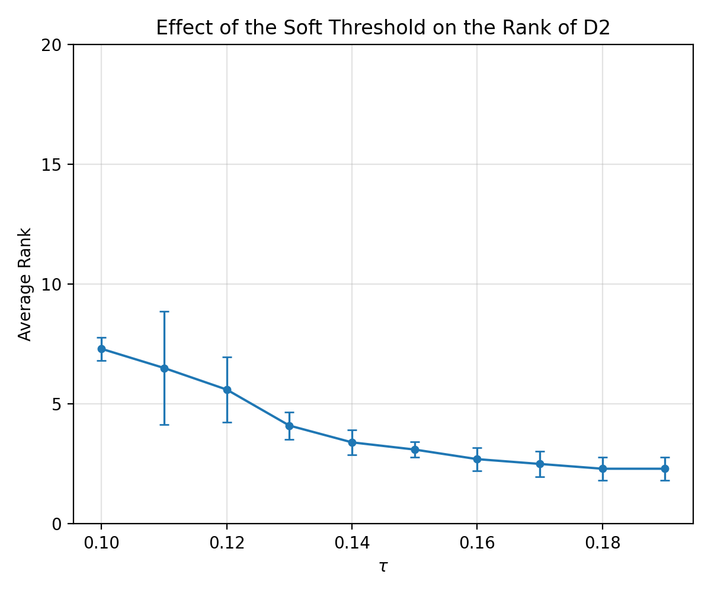

*图 11：τ 对 D2 有效秩的影响。τ 从 0\.10 增大到 0\.18 后，D2 平均秩由约 7\.3 降至约 2\.3。*

__图像解读：__τ 是奇异值软阈值的强度。τ 越大，越多较小奇异值会被压到 0，因此 D2 的有效秩下降。图中平均秩随 τ 增大而单调下降，说明代码中的低秩约束确实生效。这也解释了为什么 τ 是 JSSDL 的关键参数：τ 太小，D2 不够低秩，可能混入特性和噪声；τ 太大，D2 过度低秩，可能损失正常共性中的细节。

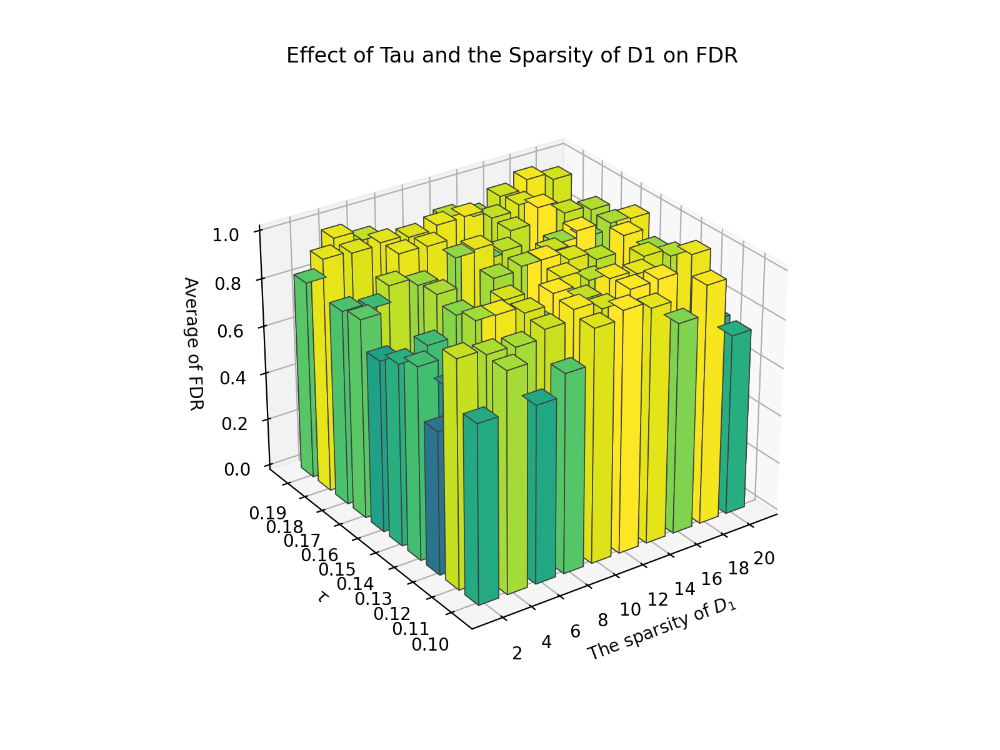

*图 12：τ 与 D1 稀疏度对 FDR 的影响。较高 τ 往往强化低秩共性约束，但过强约束会影响局部结果稳定性。*

__图像解读：__这张 3D 图展示两个结构参数对故障检测率的共同影响。D1 稀疏度控制每个特性原子能使用多少变量，τ 控制共享字典 D2 的低秩程度。可以看到，FDR 并不是由单个参数线性决定的，而是取决于“特性表达能力”和“共性压缩强度”的平衡。如果 D1 太稀疏，正常特性表达不足；如果 D1 太宽松，又可能吸收故障变化。如果 D2 低秩约束太弱，共性结构不明显；太强则可能欠拟合。

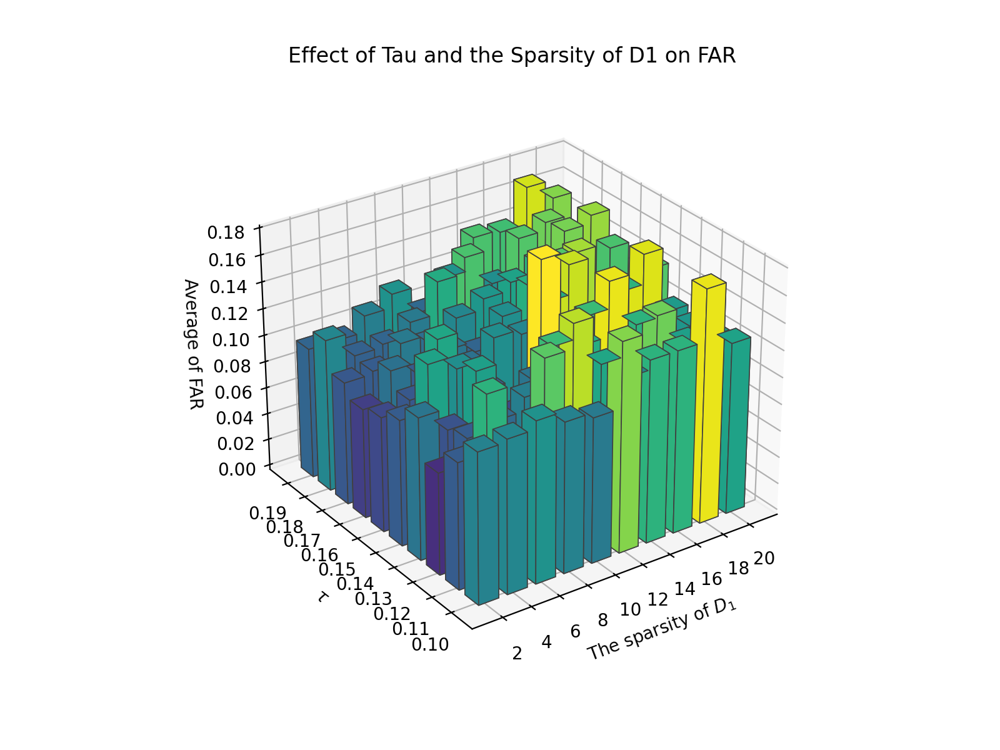

*图 13：τ 与 D1 稀疏度对 FAR 的影响。FDR 提升通常伴随 FAR 控制压力，需要在检测率和误报率之间折中。*

__图像解读：__FAR 图用于观察正常样本被误报的风险。与 FDR 图对比可以发现，有些参数组合能提高检测率，但同时会让正常段更容易越过阈值。这说明 JSSDL 参数选择不是单纯追求最高 FDR，而要在故障敏感性和正常工况容忍度之间折中。本次主实验选择 τ=0\.18、D1 稀疏度为 2，是倾向于保持 D2 低秩和 D1 高稀疏的配置，在平均 FDR 上有明显优势，同时 FAR 与 PCA 接近。

# 4\. 数值模拟实验设计

数值模拟实验的目的，是构造一个已知由“稀疏特性 \+ 低秩共性 \+ 噪声”组成的数据集，从而验证 JSSDL 是否能恢复这种结构并完成故障监测。复现代码位于 experiments/exp1\_numerical\.py，数据生成函数位于 jssdl/utils/data\_loader\.py。

y = w1·y1 \+ w2·y2 \+ e

y1: only two randomly selected dimensions are nonzero

y2 = A·s, A ∈ R^\(20×2\), s ~ N\(1, 0\.5\)

e ~ N\(0, 0\.1\), fault: add bias 10\.0 to feature index 2 \(zero\-based\)

这里 y1 每个样本只激活两个特征维度，天然符合稀疏特性；y2 由 20×2 的观测矩阵 A 和二维状态 s 生成，所有样本共享同一个 A，因此列空间低秩且强相关。这样的设计模拟了工业过程中的公共动态结构与局部工况差异。测试集前 500 个样本为正常样本，后 500 个样本在第 3 个变量上加入幅值为 10 的偏置故障。

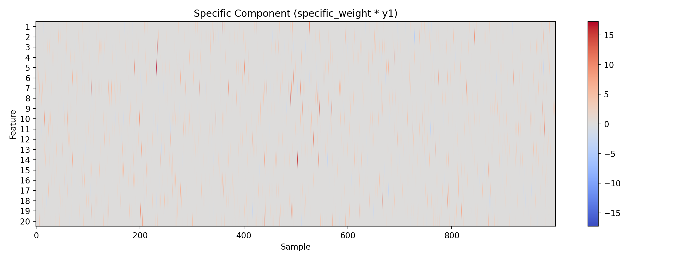

*图 14：数值模拟训练集的特性成分。只有少数变量在少数样本上出现明显值。*

__图像解读：__这张图几乎大部分区域接近背景色，只有非常细的红蓝竖线分布在少数变量上。这正好对应数据生成中的 y1：每个样本随机选择两个维度产生非零特性。因此，它不是随机噪声的均匀扩散，而是具有明确稀疏结构的局部变化。这类变化在工业过程中可以类比为某些传感器受工况、阀门动作或局部扰动影响，而不是所有变量一起变化。

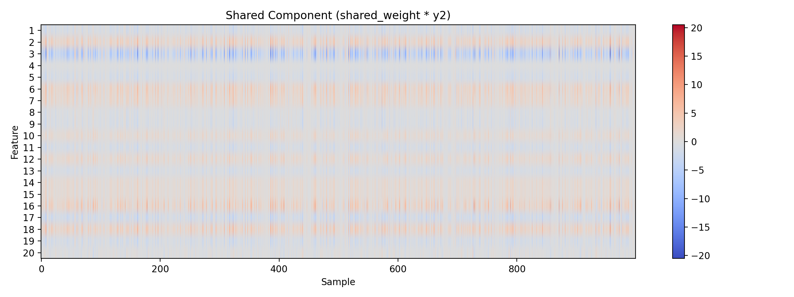

*图 15：数值模拟训练集的共性成分。多变量呈现共享的条带和相关结构。*

__图像解读：__与图 14 相比，共性成分不是零散单点，而是在多个变量上同时出现连续条带。这是因为 y2 = A·s，所有样本共享同一个观测矩阵 A，变化只来自低维状态 s。因此，不同变量之间会呈现同步或反向同步的相关模式。这张图说明数值模拟并不是任意构造数据，而是有意模拟工业过程中的公共潜变量驱动结构。

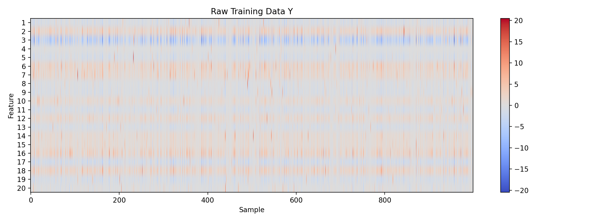

*图 16：数值模拟训练数据 Y。Y 是特性、共性和噪声的叠加。*

__图像解读：__图 16 是图 14 和图 15 加噪声后的观测结果。可以看到，共性条带提供了整体相关背景，稀疏特性则表现为局部尖锐变化。这正是论文希望解决的场景：原始观测数据中两类结构叠在一起，传统 PCA 只能学习一个整体低维空间，RPCA 倾向于把稀疏部分剔除，而 JSSDL 则试图把两部分都纳入模型。

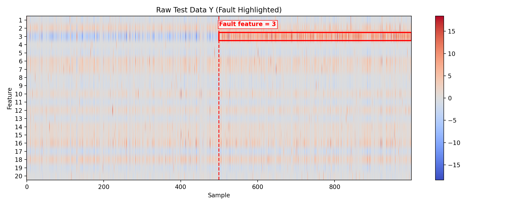

*图 17：测试集热力图。后半段样本施加偏置故障，故障位置被标注。*

__图像解读：__测试集前 500 个样本为正常样本，后 500 个样本为故障样本。故障通过在指定变量上加入固定偏置产生，因此它不是所有变量同时异常，而是一个局部维度的持续偏移。这种故障设置与论文问题很贴合：故障同样具有局部性，容易与正常特性混淆。好的监测模型需要既容忍正常稀疏特性，又能在故障段出现系统性偏移时让重构误差升高。

# 5\. 复现实验结果展示

结果展示分为两个层次：首先看代表性单次实验的监测曲线，观察各方法在故障开始后是否明显越过阈值；然后看 20 次重复实验平均指标，避免只依据单次随机结果判断模型优劣。

## 5\.1 PCA 与 RPCA 监测曲线

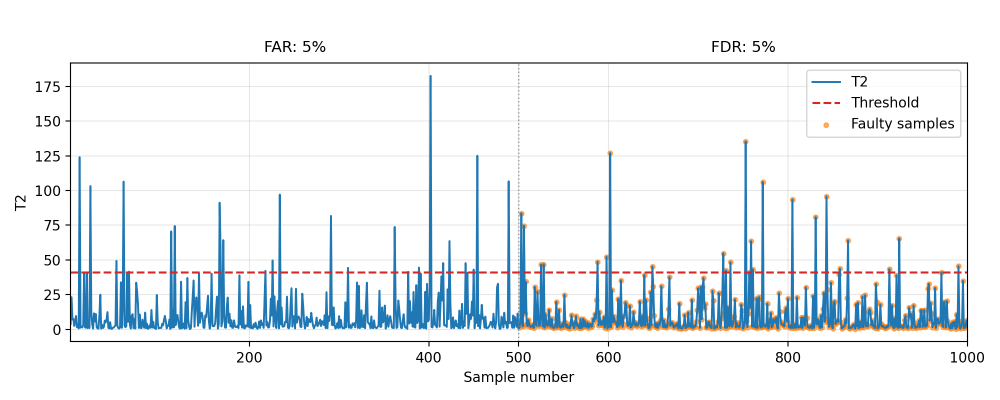

*图 18：PCA T2 监测曲线。主空间统计量对本次偏置故障不敏感，代表性单次 FDR 仅 4\.0%。*

__图像解读：__T2 统计量反映样本在 PCA 主空间内是否异常。图中故障开始后，橙色故障点大多数仍低于阈值，说明该偏置故障没有明显改变 PCA 主成分得分。这体现了 PCA 的一个问题：如果故障方向不在主空间中产生足够大的投影变化，T2 很难检测到。因此，单独依赖主空间统计量会造成严重漏检。

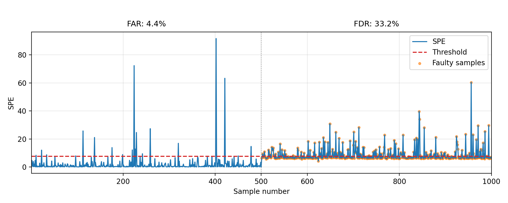

*图 19：PCA SPE 监测曲线。残差空间能捕获部分故障，但仍存在较多漏检。*

__图像解读：__SPE 衡量样本无法被 PCA 主空间重构的残差。故障段中有一些尖峰超过阈值，说明偏置故障确实在残差空间中留下痕迹；但大量橙色故障点仍贴近阈值以下，说明 PCA 的残差模型不能稳定地区分故障和正常局部特性。这也解释了为什么 PCA 平均 FDR 较低：它能抓到强烈异常点，但对持续而局部的偏置故障不够敏感。

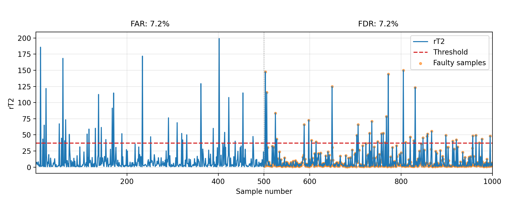

*图 20：RPCA rT2 监测曲线。低秩清理后主空间表现仍受限。*

__图像解读：__RPCA 的 rT2 在低秩部分上计算，理论上比 PCA 更少受稀疏扰动污染。但图中故障段仍有大量样本没有超过阈值，说明清理后的低秩主空间依旧不能充分表达故障差异。原因在于偏置故障可能更接近稀疏方向，而不是低秩主空间内的显著漂移。

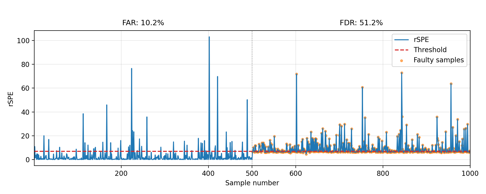

*图 21：RPCA rSPE 监测曲线。RPCA 相比 PCA 有改善，但误报和漏检问题仍然存在。*

__图像解读：__rSPE 的故障段整体略有抬升，说明 RPCA 去除部分稀疏干扰后，残差空间对故障更敏感。但是正常段也存在不少尖峰，故障段也并非全部超过阈值。这说明 RPCA 的“低秩 \+ 稀疏”分解虽然有帮助，但它没有把正常特性作为可学习结构保留下来，因此在线阶段仍面临把特性误判为故障、或把故障当作稀疏扰动忽略的矛盾。

## 5\.2 DL 与 JSSDL 监测曲线

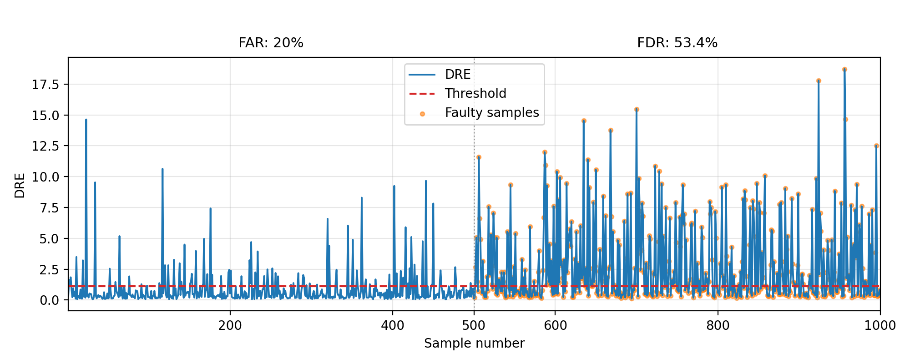

*图 22：传统字典学习 DRE 监测曲线。单字典能拟合数据，但无法显式区分稀疏特性与低秩共性。*

__图像解读：__DL 使用一个普通字典重构数据，因此监测统计量 DRE 反映单字典重构误差。图中故障段比 PCA/RPCA 更容易出现越阈值，说明字典学习的非正交表示能力确实更强；但正常段也有较多尖峰，导致 FAR 偏高。原因是单字典没有结构分工：同一批原子既要解释低秩共性，又要解释稀疏特性，模型容易在重构能力和异常敏感性之间失衡。

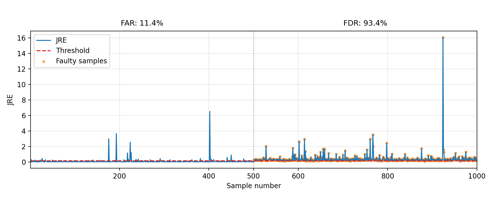

*图 23：JSSDL JRE 监测曲线。故障段 JRE 整体抬升，代表性单次实验 FDR 达 92\.4%。*

__图像解读：__JSSDL 的 JRE 是同时使用 D1 和 D2 重构后的联合残差。故障开始后，橙色点整体抬升并大量超过阈值，说明正常数据中的稀疏特性和低秩共性已经被模型较好吸收；当测试样本出现持续偏置故障时，这种偏移不能再被正常的 D1/D2 组合充分解释，于是残差增大。与 DL 相比，JSSDL 的优势不是简单降低重构误差，而是把重构能力分配给“特性字典”和“共享字典”，使正常局部变化与故障局部偏移之间更容易被区分。

结合你已有 PPT 的最终汇报版本，需要把这里进一步解释为“JSSDL 基础版已经证明双字典结构有效，但 OMP 编码仍会带来少量过大系数；加入 ridge\_X1=0\.05 后，模型在 20 次重复实验中的平均 FDR 从基础版的 79\.6% 提升到 89\.2%，平均 FAR 从 10\.9% 降到 10\.5%”。因此，最终结论不是单纯“JSSDL 比基线好”，而是“JSSDL 的结构建模提供主要收益，ridge\_X1 正则进一步提升了复现稳定性”。

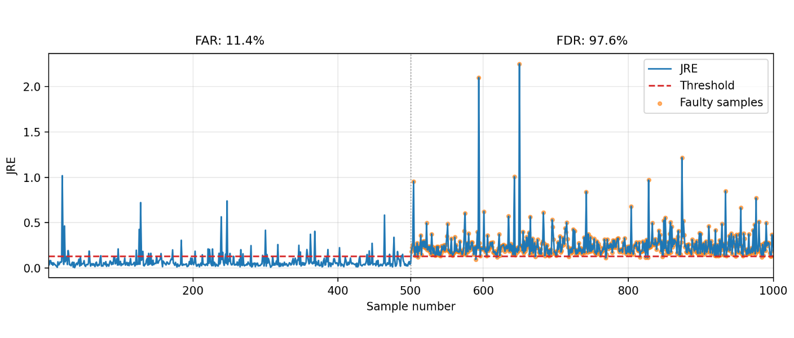

*补充图 A：PPT 中 ridge\_X1=0\.05 后的 JSSDL 监测曲线，单次结果 FAR=11\.4%、FDR=97\.6%。*

__图像解读：__这张图来自你已有 PPT，是最终汇报中非常值得保留的一张证据图。与基础 JSSDL 曲线相比，故障段橙色点整体更稳定地位于阈值上方，说明加入 ridge\_X1 后，特性编码不再过度依赖少数异常大的系数，联合重构误差对真实故障段更加敏感。正常段 FAR 仍为 11\.4%，说明误报没有完全消失，但 FDR 达到 97\.6%，适合作为“正则项改进后检测能力进一步增强”的代表性单次结果。

__版本__

__平均 FAR__

__平均 FDR__

__说明__

JSSDL \(ridge\_X1=0\)

10\.9%

79\.6%

初始复现版本，未对 OMP 的 X1 最小二乘系数做正则

JSSDL \(ridge\_X1=0\.05\)

10\.5%

89\.2%

最终汇报版本，抑制 X1 异常大系数后检出率明显提升

*表 3：JSSDL 基础版与 ridge\_X1 改进版对比。*

这个对比应放在汇报的结果章节末尾，用来承接后面的“复现问题与解决过程”。它说明复现不是只跑通论文算法，而是在发现 OMP 编码系数异常后，进一步做了可解释的工程修正。

# 6\. 复现问题与解决过程

## 6\.1 OMP 编码中的系数过大问题

复现过程中发现，使用 OMP 求解 X1、X2 时，少数样本可能出现过大的稀疏系数。这会带来两个影响：一是训练阶段字典更新对少数样本过度响应；二是监测阶段 JRE 阈值和异常分数更容易被极端点牵动。项目中保留了 X1 系数诊断图，用于比较训练编码和监测编码的非零系数分布。

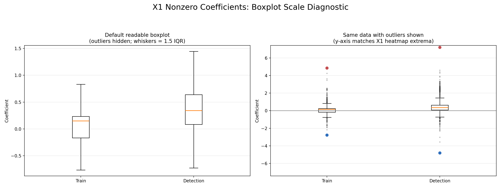

*图 24：OMP 编码下 X1 非零系数诊断。监测阶段存在更宽分布和极端离群点。*

__图像解读：__左侧箱线图隐藏离群点后可以看到，监测阶段 X1 非零系数的分布比训练阶段更宽；右侧把离群点显示出来后，能看到少数系数绝对值非常大。这说明 OMP 在某些样本上为了追求最小残差，会选择少量原子并赋予较大系数。这种现象会使模型对个别样本过度敏感，进而影响阈值估计和 FAR/FDR 的稳定性。因此，这张图不是为了展示模型优势，而是诚实说明复现中遇到的数值问题。

## 6\.2 Lasso 替代求解与 ridge\_X1 最终选择

为缓解 OMP 系数不稳定，项目中额外实现了 Lasso 求解版本。Lasso 通过 L1 正则直接压缩系数，在保存的实验中故障检出率达到 100%，说明它确实增强了故障段分离；但 FAR 仍为 10\.6%，并且 D2 有效秩升至 18，偏离了共享字典低秩的建模目标。因此，Lasso 更适合作为问题诊断和对照实验，而不是最终采用的复现版本。

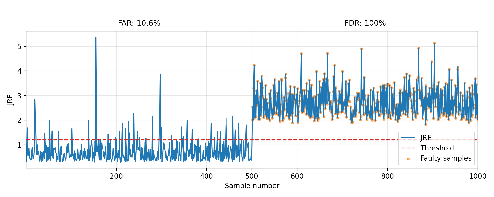

*图 25：Lasso 版本 JSSDL 监测曲线。FDR 提升明显，但正常段仍有误报。*

__图像解读：__Lasso 版本把稀疏编码从硬选择的 OMP 改为带 L1 正则的连续优化。图中故障段几乎全部超过阈值，说明 Lasso 的系数收缩提高了故障段和正常段的分离度。但正常段仍然有越阈值点，FAR 没有被完全压下去。更重要的是，Lasso 版本保存的 rank\_D2 为 18，说明共享字典低秩结构被削弱；因此它虽然检测效果变好，却偏离了论文“共享字典表达低秩共性”的核心设定。

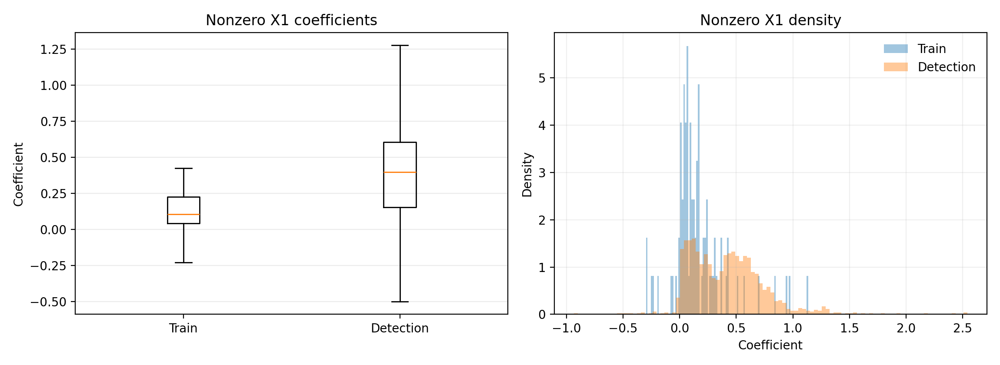

*图 26：Lasso 版本 X1 非零系数分布。系数更集中，但检测阶段仍比训练阶段更分散。*

__图像解读：__这张图解释了为什么 Lasso 能缓解一部分 OMP 问题：训练阶段非零系数更集中，极端值更少。但检测阶段的分布仍明显向更大系数区域扩展，说明测试样本尤其是故障样本仍需要更强的特性编码来重构。因此，Lasso 是一个有效尝试，但不是最终完美方案。最终选择回到 OMP 框架，在 X1 的最小二乘求解中加入 ridge\_X1=0\.05，这样既尽量保留论文 OMP 编码流程，又能抑制异常大系数。

__分组__

__零元素比例__

__非零个数__

__非零绝对值均值__

__非零绝对值 95% 分位__

__最大绝对值__

train

99\.91%

86

0\.197

0\.668

1\.136

detection

98\.46%

1541

0\.421

0\.940

2\.540

*表 4：Lasso 版本 X1 系数分布摘要。*

最终的折中方案是在 OMP 最小二乘步骤中加入 ridge 正则入口，用正则化最小二乘抑制异常大的 X1 系数。从 PPT 中的 20 次平均结果看，ridge\_X1=0\.05 后 JSSDL 的平均 FDR 提升到 89\.2%，FAR 降到 10\.5%，说明这一修正确实提升了复现稳定性。但它仍是工程层面的正则化改进，并未从理论上彻底解决 OMP 选择原子时可能对局部样本过敏的问题；因此，本次复现结论中仍需要保留这一不足。

# 7\. 总结

本次复现围绕 JSSDL 的工业过程监测思想，完成了论文阅读、数据生成、模型实现、基线对比、参数敏感性分析和问题诊断。报告中首先用 TEP 可视化说明工业数据中共性与特性并存；随后解释 PCA、RPCA 在此类场景中的不足；再通过公式和训练诊断图说明 JSSDL 如何分别用 D1 表达稀疏特性、用 D2/P 表达低秩共性。

结合已有 PPT 后，最终汇报口径应强调两个层次的结论：第一，JSSDL 的双字典结构本身优于 PCA、RPCA 和传统 DL；第二，复现中发现 OMP 的 X1 系数可能过大，因此加入 ridge\_X1=0\.05 后，20 次平均 FDR 从基础版 79\.6% 提升到 89\.2%，FAR 从 10\.9% 降到 10\.5%。这说明复现工作不仅跑通了论文方法，还围绕数值稳定性做了有证据支撑的改进。同时，这一改进仍有不足：ridge 正则缓解了系数问题，但没有完全解决 OMP 原子选择可能不稳定的理论问题。后续工作可以继续围绕更稳定的稀疏编码、阈值估计、真实 TEP 故障集上的系统测试，以及最终 PPT 的视觉组织展开。

