# temp

- Source: `temp.pptx`
- Total slides: 26

## Slide 1

掌纹识别门禁系统

COURSE DESIGN DEFENSE

从掌纹采集、特征编码、身份匹配到 STM32 控制开锁的完整系统实现

小组成员：翁嘉程、罗志铭、李佳洋

## Slide 2

01

项目背景与系统架构

Project Background and System Architecture

02

技术路线与算法原理

目录

Technical route and algorithm principles

硬件连接与结果演示

03

CONTENTS

Hardware Connection and Result Demonstration

不足与总结

04

Limitations and Summary

## Slide 3

01

项目背景与系统架构

Background and Architecture

掌纹识别适用于非接触式身份认证，本系统目标是打通从掌纹采集到门锁控制的完整闭环

## Slide 4

项目背景

Project Background

掌纹识别技术

系统目标

采集方式

通过手掌主线、皱褶和细节纹理等特征，对用户身份进行认证的生物特征识别技术

可使用普通 RGB 摄像头完成非接触采集；也可使用专用掌纹/掌静脉设备完成高安全采集。

实现采集、预处理、编码、匹配、日志记录和开锁反馈的全链路系统

## Slide 5

掌纹识别典型应用场景

Application Scenarios

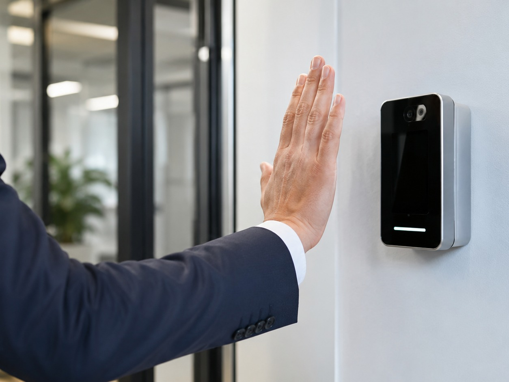

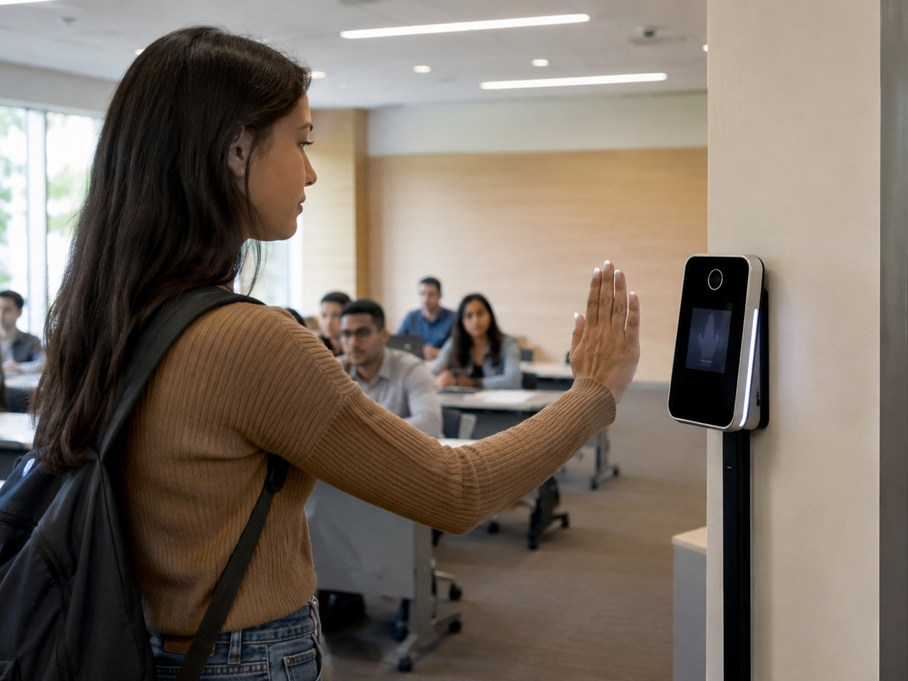

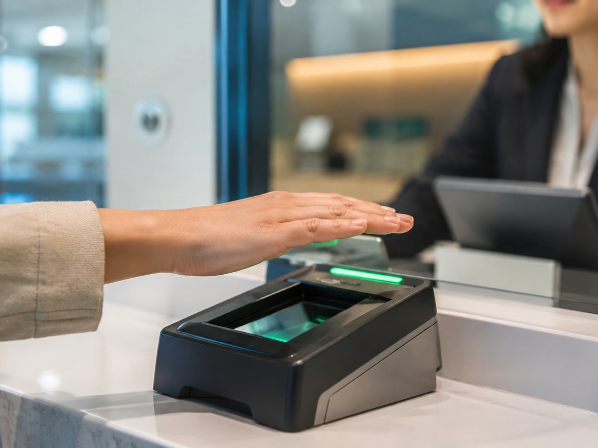

门禁通行

考勤签到

安防核验

宿舍、实验室、办公区域的非接触身份核验

课堂、会议、工位打卡等高频认证场景

金融柜台、自助终端、重点区域二次确认

应用层价值：减少接触、降低忘带卡/借卡风险，并可与日志系统联动形成可追溯的通行记录

### Speaker Notes

5

## Slide 6

掌纹识别技术优势

Why Palmprint Recognition

普通摄像头即可

非接触体验好

掌纹图像可通过普通 RGB 摄像头采集，无需指纹模组或虹膜采集设备。这降低了硬件成本和部署难度，更适合实验室、教室、宿舍等门禁场景

用户只需将手掌放置在摄像头前完成识别，无需接触公共设备。这种方式更加卫生、自然，适合高频通行场景，用户接受度也更高

隐私争议较小

纹理特征丰富

掌纹区域面积较大，包含主线、褶皱、细小纹理等多层次特征。相比单一局部特征，掌纹信息量更充足，有利于提升身份区分能力和识别稳定性

掌纹不像人脸一样容易在公共场景中被远距离采集，用户感知更可控。因此在门禁认证场景中，掌纹识别兼顾了安全性、便利性和隐私保护

## Slide 7

掌纹识别主流方法

System Architecture Design

线特征方法

子空间/统计方法

编码类方法

深度学习方法

提取主线、褶皱线、方向线等显著结构，解释性强，但对 ROI 对齐和图像质量较敏感。

PCA、LDA、ICA 等方法将掌纹图像投影到低维特征空间，适合早期小规模数据集。

PalmCode、CompCode、Ordinal Code 等通过方向滤波和二值/多值编码表达纹理，实时性好。

CNN、Siamese Network、Transformer 等可学习高层特征，但更依赖大规模数据和算力。

本系统选择 CompCode：算法链路清晰、计算量较低、易于和阈值判决及模板数据库结合，适合课程设计原型。

## Slide 8

系统架构设计

System Architecture Design

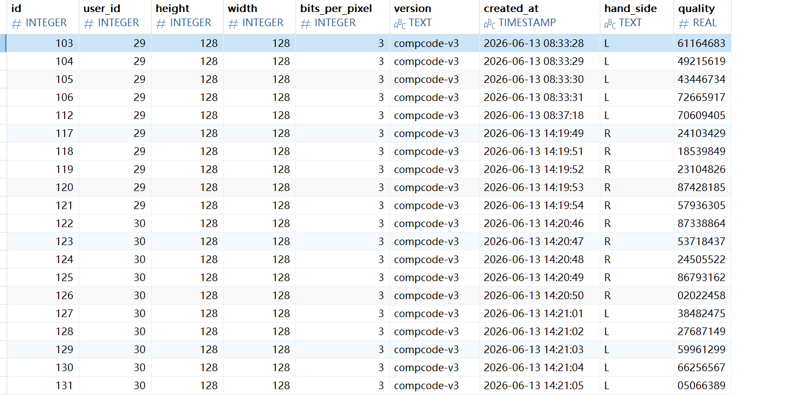

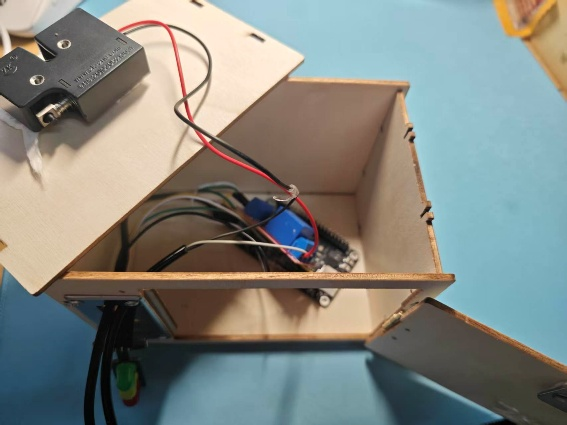

前端与后端编排

硬件执行层

算法与数据存储

Vue 3 + Naive UI 提供注册、验证和日志页面；Flask 负责 API 编排与流程调度

算法层完成 ROI、Gabor、CompCode 和匹配；SQLite 保存用户、模板与识别记录

STM32 接收串口命令，控制继电器、电磁锁、LED 与蜂鸣器，实现开锁反馈

## Slide 9

系统设计图

System design diagram

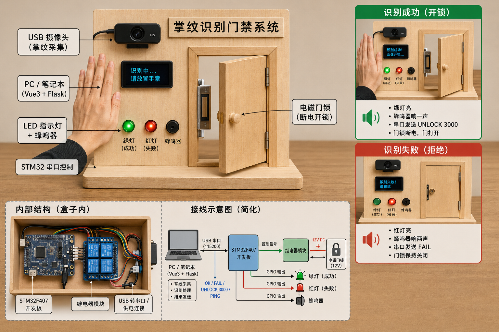

## Slide 10

02

技术路线与算法原理

Principles and Implementation

采用前后端分离与硬件抽象层设计，算法核心基于 Gabor + CompCode 完成编码和匹配

## Slide 11

软件架构

Software Architecture

## Slide 12

掌纹识别算法流程

Palmprint Recognition Algorithm Flow

预处理链路

匹配链路

- 原图 → 灰度化处理 → CLAHE 直方图均衡
- → ROI 裁剪为 128×128

- 6 方向 Gabor 滤波 → CompCode 编码
- → 掩码归一化汉明距离 → 阈值判决

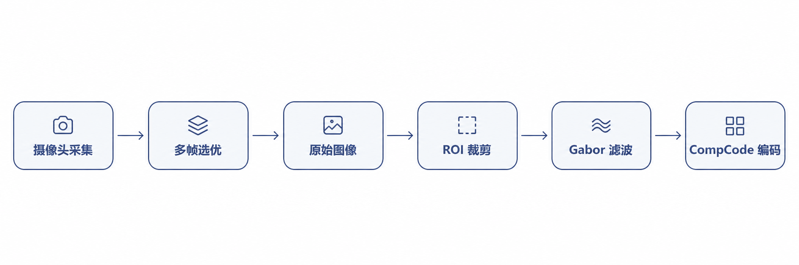

最终输出：用户身份、匹配距离、阈值判断结果，并触发开锁或失败反馈

## Slide 13

算法关键技术

Key Algorithm Techniques

CompCode 竞争编码

Shift Matching

由于用户每次放置手掌的位置不可能完全一致，即使是同一个人，ROI 也可能存在轻微平移。因此在匹配时，系统会在 ±6 像素范围内对模板进行平移搜索，分别计算匹配距离。最终取最小距离作为匹配结果，以减小手掌位置偏差对识别结果的影响。

系统首先对 ROI 掌纹区域进行 6 个方向的 Gabor 滤波，提取不同方向上的纹理响应。对于每个像素点，选择响应最强的方向作为该点的编码结果，从而把掌纹纹理转化为方向编码特征。这种方法计算量较小，适合课程设计中的实时验证场景

掩码归一化

阈值判决

掌纹图像中可能存在过暗、过曝、背景干扰或无效区域，如果直接参与匹配，会影响距离计算的准确性。因此系统通过掩码标记有效像素区域，只在有效区域内计算汉明距离。这样可以减少噪声干扰，使匹配结果更加稳定。

系统将当前掌纹编码与数据库中的模板逐一匹配，得到最小匹配距离。如果该距离小于设定阈值，则认为验证通过，并向 STM32 发送开锁指令。如果距离大于阈值，则判定为验证失败，同时记录日志并触发红灯或蜂鸣器反馈。

## Slide 14

手掌检测：MediaPipe

Palmprint Recognition Algorithm Flow

## Slide 15

ROI 提取与 Zhang 坐标系

ROI and Zhang Coordinate System

## Slide 16

CompCode 竞争编码

Competitive Code

## Slide 17

模板存储与匹配逻辑

Template Storage and Matching Logic

## Slide 18

数据集标定结果

Dataset Calibration Results

## Slide 19

03

硬件连接与结果演示

Hardware and Demonstration

前端负责交互展示，后端完成识别与控制指令下发，STM32 驱动电磁锁和反馈设备。

## Slide 20

硬件架构

Hardware Architecture

## Slide 21

硬件设计与串口协议

Hardware Design and Serial Protocol

继电器 + 电磁锁

STM32 F407

继电器控制 12V 电磁锁回路通断，电磁锁独立供电更安全。

主控板接收 PC 串口命令，负责驱动继电器、LED 和蜂鸣器。

ASCII 行协议

LED / 蜂鸣器反馈

UNLOCK <ms> 开锁；OK 成功反馈；FAIL 失败反馈；PING 健康检查。

识别成功亮绿灯并单响；识别失败亮红灯并双响。

## Slide 22

软件演示与效果评估

Software Demonstration and Evaluation

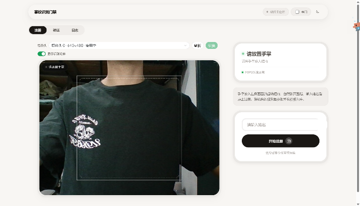

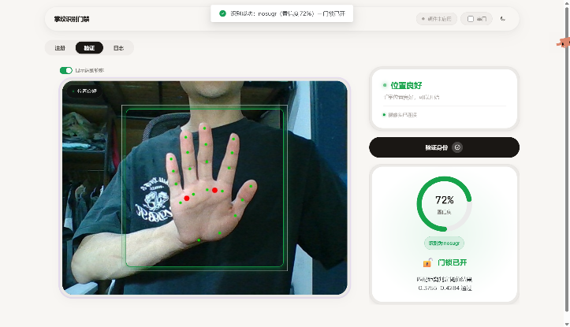

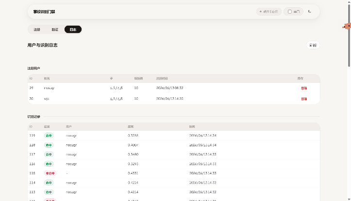

注册页

验证页

日志页

输入姓名 → 采集掌纹 → 显示质量评分 → 保存用户模板。

摄像头预览 → 点击验证 → 显示用户、距离、阈值和结果。

分页查看识别记录，便于追踪成功 / 失败验证过程

演示链路：点击验证 → 抓取 6 帧 → 选最清晰 → 预处理 → 编码匹配 → 命中开锁

评估指标：EER、FAR、FRR、ROC/DET 曲线、真伪距离分布

## Slide 23

04

不足与总结

Limitations and Summary

系统已完成从算法验证到软硬件联调的闭环，后续可从准确率、安全性和嵌入式部署继续优化

## Slide 24

问题与解决方案

Problems and Solutions

同人距离偏大

ROI 提取不稳定

同一个人在多次验证时，手掌放置位置和角度不可能完全一致，ROI 区域会出现轻微平移或偏移。 如果直接进行模板匹配，即使是同一个用户，也可能因为几像素的位置差异导致汉明距离偏大。 因此系统加入 ±6 像素范围的 shift matching，在小范围内平移模板并取最小距离作为最终匹配结果，从而提升同人匹配稳定性。

在早期实现中，系统主要依赖 HSV 颜色分割和 OpenCV 轮廓检测来定位手掌区域。但实际测试发现，摄像头光照变化、手掌肤色差异、背景颜色接近等情况都会导致分割结果不稳定，进而影响 ROI 裁剪位置。为了解决这个问题，后续改用 MediaPipe 手部关键点检测，根据手掌关键点坐标计算 ROI 区域，使裁剪位置更加稳定。

软硬件联调困难

阈值调参困难

项目开发过程中，STM32 固件、串口通信和 PC 端识别程序并不是完全同步完成的。如果必须等硬件全部调通后再测试算法和后端流程，会明显降低开发效率。因此我们设计了硬件抽象层，并提供 MockBridge 模拟硬件响应，使 PC 端可以先完整跑通注册、验证、判决和开锁流程，最后再切换到真实串口硬件。

不同用户、不同光照条件下的掌纹匹配距离会存在差异，真样本和伪样本距离分布可能有一定重叠。阈值设置过低会导致本人被拒绝，阈值设置过高又可能增加误接受风险。因此我们通过 EER、FAR、FRR 等指标分析匹配结果，并结合距离分布选择较合适的判决阈值，使系统在安全性和通过率之间取得平衡。

## Slide 25

总结与展望

Summary and Outlook

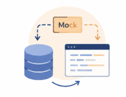

已完成

系统特点

后续优化

采集 → 预处理 → 编码 → 匹配 → 开锁闭环；Web 端支持注册、验证和日志

算法层零硬件依赖；硬件抽象层支持 Mock 与真实串口快速切换

引入 CNN 特征、活体检测、多人并发识别，并尝试嵌入式独立部署

最终成果：从算法验证走向可演示的门禁系统原型

## Slide 26

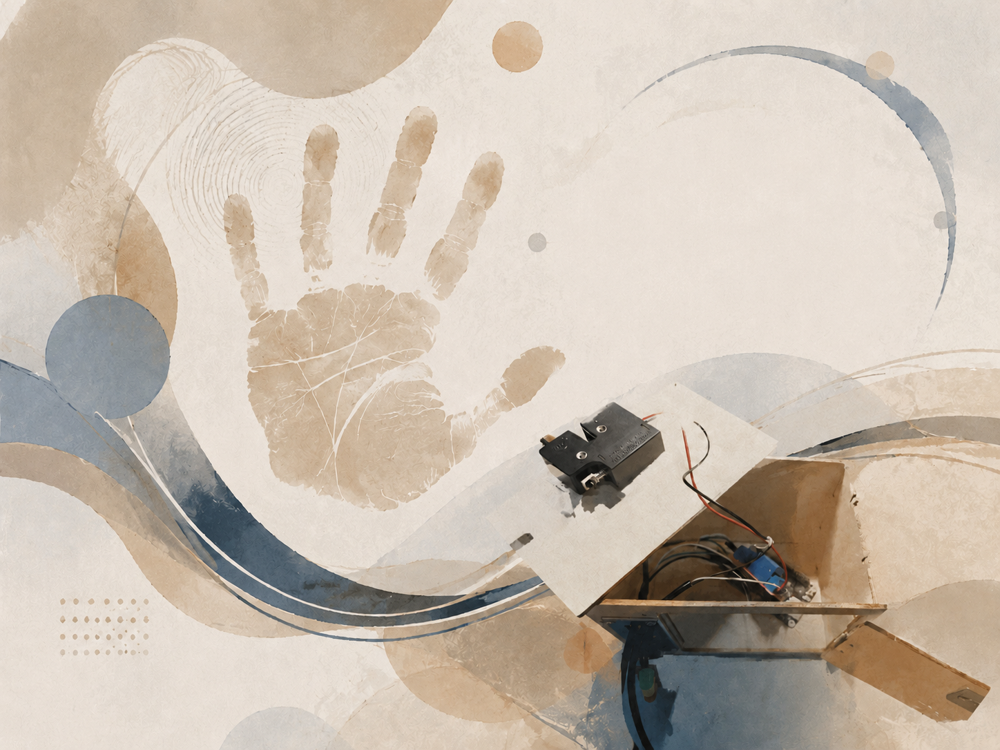

谢谢观看

THANK YOU

掌纹识别门禁系统答辩结束，欢迎老师批评指正
